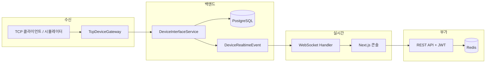

# CareBridge Platform


<br/>
의료 장비·게이트웨이에서 들어오는 TCP 메시지를 수신·해석·저장하고, 운영자 콘솔에서 실시간 채팅·접속자·장비 이벤트를 한 화면에서 볼 수 있게 만든 풀스택 샘플 프로젝트 입니다.

| 구분 | 기술 |
|------|------|
| Backend | Java 21, **Spring Boot 4**, Spring Security(JWT), JPA, PostgreSQL, Redis, WebSocket, 커스텀 TCP 게이트웨이 |
| Frontend | **Next.js 16**(App Router), **React 19**, TypeScript, pnpm |

---

## 왜 만들었나

병원·검사실 환경에서는 EMR만 쓰는 것이 아니라, 장비 전용 프로토콜(TCP, 키-밸류, HL7 스타일 등)으로 들어오는 데이터를 중간 계층에서 받아 정리해야 하는 경우가 많습니다.<br/>
이 프로젝트는 그 흐름을 단순화해 보여 주기 위해

- 동일한 수신 경로로 실제 TCP 클라이언트와 내장 시뮬레이터 트래픽을 처리하고
- 수신 결과를 **PostgreSQL에 영속화**한 뒤
- **WebSocket**으로 대시보드에 푸시하는

구조를 한 번에 구현했습니다.

---

## 핵심 기능

1. **장비 인터페이스(TCP)**  
   - 별도 포트(`9093` 기본)에서 TCP 접속을 받고, 페이로드를 해석한 뒤 ACK를 반환합니다.  
   - **키-밸류 파이프(`|`) 형식**과 **HL7 스타일** 등, 여러 `DevicePayloadInterpreter`로 확장 가능한 구조입니다.

2. **저장 및 개요 API**  
   - 장비 이벤트를 JPA로 저장하고, 최근 이벤트·총 건수·마지막 수신 시각 등을 REST로 제공합니다.

3. **실시간 운영 콘솔(Next.js)**  
   - 로그인/회원가입 후 JWT로 보호된 REST API 호출.  
   - WebSocket(`/ws/chat`)으로 채팅, 접속자 목록 갱신, **신규 장비 이벤트 브로드캐스트**를 수신합니다.

4. **Presence(접속 상태)**  
   - Redis 기반으로 온라인/오프라인을 표시하고, 주기적 ping으로 상태를 유지합니다.

5. **내장 장비 시뮬레이터**  
   - 백엔드 기동 후 일정 간격으로 로컬 TCP 포트로 샘플 페이로드를 보내, UI 없이도 end-to-end 흐름을 확인할 수 있습니다.

6. **작업 보드(Work Items)** *(API + 프론트 모듈)*  
   - 칸반 스타일 작업 항목 CRUD에 가까운 API(`POST/PATCH/GET /api/work-items`)와, Redis 캐시를 쓰는 서버 구현이 포함되어 있습니다.  
   - 홈 화면은 **Carebridge 콘솔** 단일 페이지이며, `WorkItemBoard` 컴포넌트는 필요 시 페이지에 연동해 사용할 수 있습니다.

7. **데모 계정**  
   - 최초 기동 시 시드: `admin` / `Admin1234!`, `operator` / `Operator1234!`

---

## 아키텍처 개요



**한 줄 요약:** TCP → 파싱·저장(PostgreSQL) → 애플리케이션 이벤트 → WebSocket으로 콘솔 갱신.

---

## 저장소 구조

```
carebridge-platform/
├── backend/          # Spring Boot 단일 프로세스 (HTTP 8080 + TCP 9093)
└── web/              # Next.js 16 운영자 UI
```

---

## 사전 요구 사항

- **JDK 21** (Gradle 툴체인과 일치)
- **PostgreSQL** — 기본 설정: 호스트 `localhost`, 포트 **`5433`**, DB `carebridge` (`application.yml` 기준)
- **Redis** — 기본: `localhost:9379`, 비밀번호 `123456` (환경 변수로 변경 가능)
- **Node.js** + **pnpm** (프론트)

DB·Redis 주소/포트는 `backend/src/main/resources/application.yml` 및 환경 변수(`POSTGRES_*`, `REDIS_*`)로 맞추면 됩니다.

---

## 빠른 시작

### 1) 백엔드

```powershell
cd D:\intel3\carebridge-platform\backend
.\gradlew.bat bootRun
```

- HTTP API: `http://localhost:8080`  
- TCP 장비 수신: `localhost:9093` (동일 JVM 프로세스)

### 2) 프론트엔드

```powershell
cd D:\intel3\carebridge-platform\web
pnpm install
pnpm dev
```

브라우저에서 `http://localhost:3000` — 시드 계정으로 로그인하면 콘솔이 열립니다.

기본 API/WS 주소는 `http://localhost:8080`입니다. HTTP 포트를 바꾼 경우:

```powershell
cd D:\intel3\carebridge-platform\web
$env:NEXT_PUBLIC_API_BASE_URL='http://localhost:8081'
$env:NEXT_PUBLIC_WS_BASE_URL='ws://localhost:8081/ws/chat'
pnpm dev
```

---

## 포트 정리

| 포트 | 용도 |
|------|------|
| `8080` | REST, Actuator, WebSocket 업그레이드 |
| `9093` | TCP 장비 메시지 수신 (기본값) |

포트 확인 (PowerShell):

```powershell
cd D:\intel3\carebridge-platform\backend
.\scripts\check-carebridge-ports.ps1
```

또는:

```powershell
Get-NetTCPConnection -LocalPort 8080,9093 -State Listen
```

---

## 실시간 데이터가 도는 경로

실제 장비·수동 TCP 테스트·내장 시뮬레이터가 **같은 파이프라인**을 탑니다.

1. TCP로 `9093`에 페이로드 전송  
2. `TcpDeviceGateway`가 수신  
3. `DeviceInterfaceService`가 파싱 후 PostgreSQL에 저장  
4. TCP 클라이언트에 ACK 응답  
5. 저장된 이벤트가 WebSocket을 통해 웹 대시보드에 반영  

→ 시뮬레이터도 이 경로를 우회하지 않습니다.

---

## TCP 수동 테스트

```powershell
cd D:\intel3\carebridge-platform\backend
.\scripts\send-device-message.ps1
```

커스텀 페이로드 예:

```powershell
cd D:\intel3\carebridge-platform\backend
.\scripts\send-device-message.ps1 -Payload "DEVICE=VITAL-02|PATIENT=P-2001|HEART_RATE=81|SPO2=98|STATUS=READY"
```

HL7 스타일 예시:

```powershell
cd D:\intel3\carebridge-platform\backend
.\scripts\send-device-message.ps1 -Payload "MSH|^~\&|HL7-GATEWAY-A|CAREBRIDGE|EMR|HOSPITAL|20260321153000||ORU^R01|MSG1|P|2.5`rPID|1||P-2001||SIMULATED^PATIENT`rOBR|1||LAB1|GLUCOSE^Glucose`rOBX|1|NM|GLUCOSE^Glucose||5.6|mmol/L|3.5-7.8|N`r"
```

수락 시 스크립트가 ACK를 출력합니다.

---

## 내장 장비 시뮬레이터

기본값(`application.yml` / 환경 변수):

- `DEVICE_SIMULATOR_ENABLED=true`
- `DEVICE_SIMULATOR_INITIAL_DELAY_MILLIS=5000`
- `DEVICE_SIMULATOR_INTERVAL_MILLIS=7000`
- `DEVICE_SIMULATOR_HOST=127.0.0.1`
- `DEVICE_SIMULATOR_PORT=9093`

기동 약 5초 후 샘플 메시지가 주기적으로 유입됩니다.

---

## 로그로 수신 확인

백엔드 로그에서 예시:

- `TCP device gateway started on port 9093`
- `Simulated device payload delivered...`
- `Device event saved...`

UI에서는 **Recent device events**, **Total messages**, **Last received** 등이 갱신되는지 보면 됩니다.

---

## 포트 변경 (환경 변수)

HTTP를 `8081`, TCP를 `9094`로 옮기는 예:

```powershell
cd D:\intel3\carebridge-platform\backend
$env:SERVER_PORT='8081'
$env:TCP_SERVER_PORT='9094'
$env:DEVICE_SIMULATOR_PORT='9094'
.\gradlew.bat bootRun
```

HTTP 포트를 바꿨다면 프론트의 `NEXT_PUBLIC_API_BASE_URL` / `NEXT_PUBLIC_WS_BASE_URL`도 함께 맞춥니다.

---

## 보안·운영 참고

- REST API는 **JWT(Bearer)** 기반 stateless 인증입니다.  
- WebSocket은 연결 시 URI 등에서 토큰을 검증해 세션을 식별합니다.  
- 프로덕션에서는 `APP_TOKEN_SECRET` 등 시크릿을 반드시 교체하세요.

---

## 라이선스 / 면책

실제 의료기기·HL7 연동·규제 요구사항을 대체하지 않습니다.
