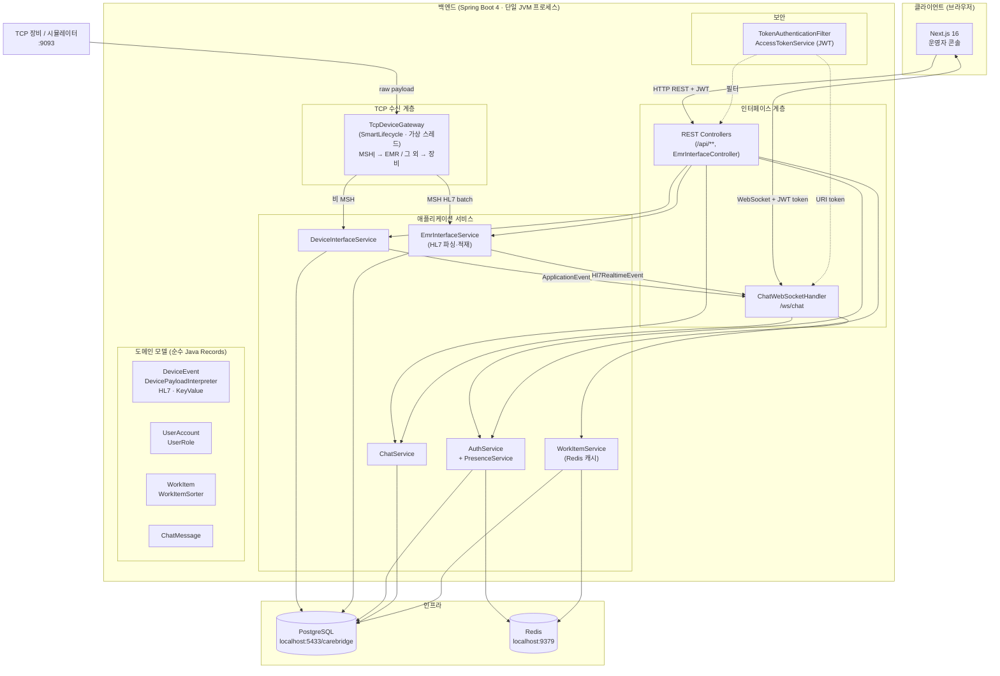
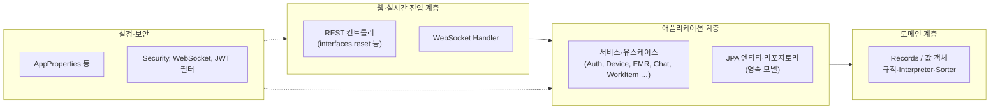
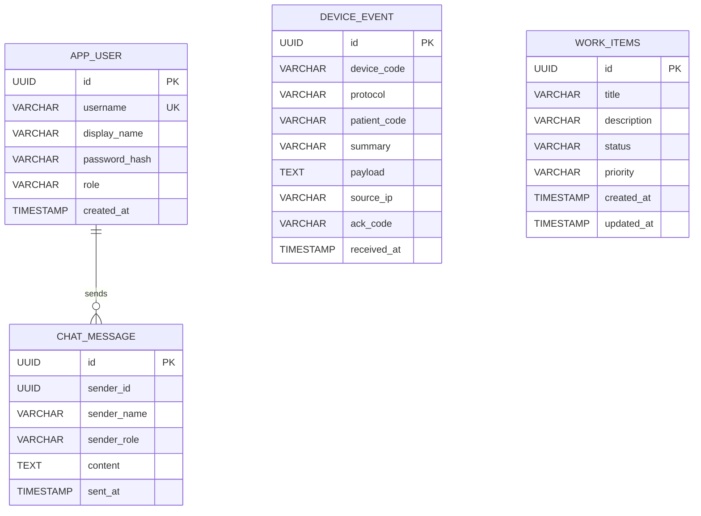
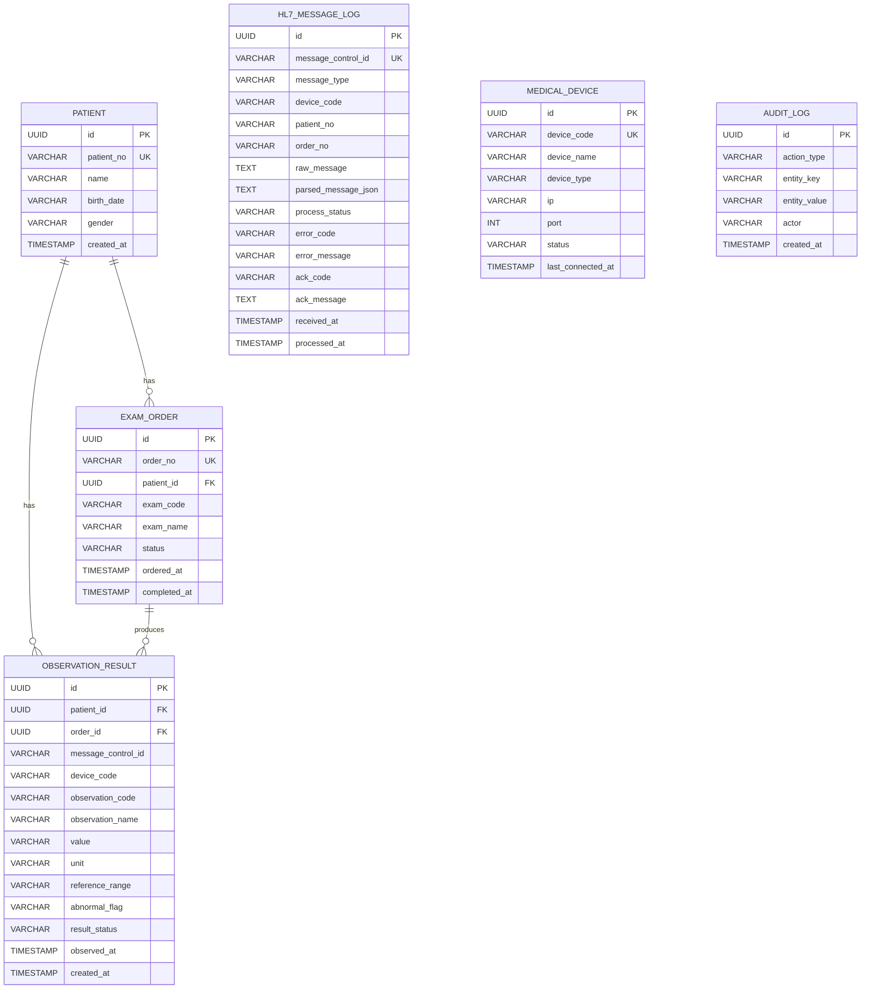
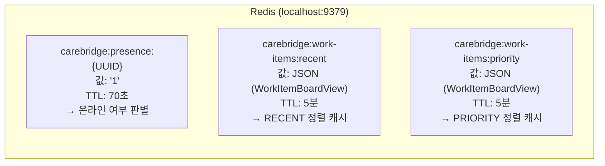
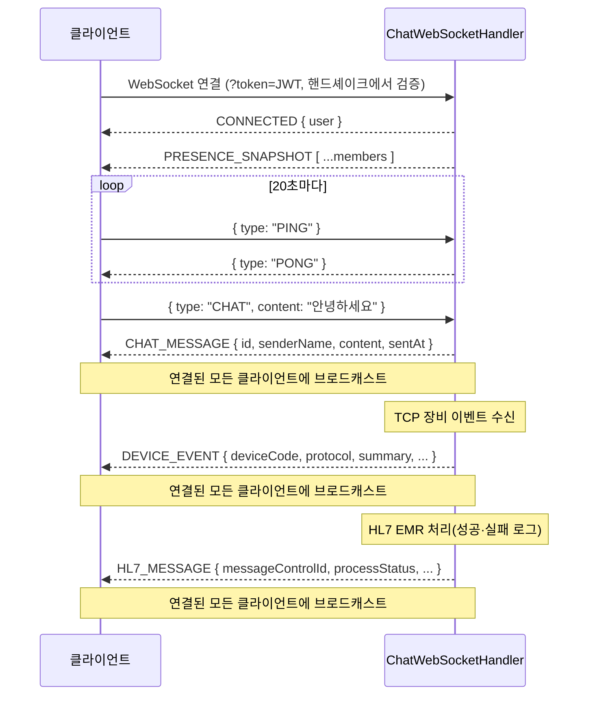
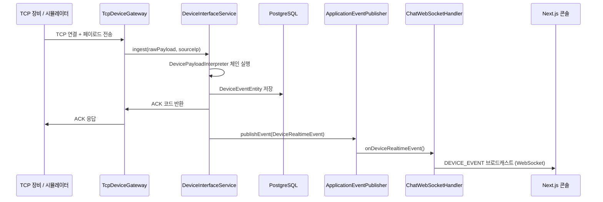
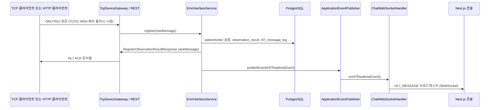

# CareBridge EMR Interface Server

> 외부 장비 메시지 수신 플랫폼을 기반으로, **HL7 ORU^R01** 검사결과 메시지를 환자·검사오더와 매칭해 `observation_result`로 저장하고, **HL7 원문 로그·ACK·EMR 콘솔 조회**까지 한 흐름으로 보여 주는 **백엔드 인터페이스 서버**입니다. 동일 TCP 포트에서 비 `MSH` 장비 페이로드는 기존처럼 `device_event` 경로로 처리합니다.

**포트폴리오 포지션:** **의료장비-HL7-EMR 연동 백엔드** — 평가자가 보통 궁금해하는 “장비에서 온 검사결과가 환자·검사오더에 어떻게 붙는가”를 코드로 설명하는 데 초점을 둡니다. README·코드·테스트가 맞물리면 **제출용 포트폴리오**로 사용해도 됩니다.

## 제출용 요약 (약 30초)

### 핵심 데모 흐름

```text
HL7 ORU^R01 REST 또는 TCP 수신
→ MSH / PID / OBR / OBX 파싱
→ messageControlId 중복 검사
→ patientNo · orderNo 매칭
→ observation_result 저장 · exam_order COMPLETED
→ hl7_message_log · audit_log 기록
→ ACK AA 또는 AE (REST는 JSON에 ackMessage 포함)
→ EMR 콘솔에서 환자 상세·HL7 로그 조회
```

### MVP에서 먼저 볼 것 (5가지)

- REST·TCP로 **ORU^R01** 수신 — 업무 처리는 동일하게 **`RegisterObservationResultUseCase`** 경로
- 환자·검사오더 검증 후 **검사결과 저장** 및 오더 **COMPLETED**
- **`hl7_message_log`** 에 원문·처리 상태·ACK (성공/실패 모두 남김)
- **`messageControlId`** 중복 시 `observation_result` 추가 저장 없음
- 콘솔 **환자·HL7 로그** 화면 및 WebSocket **`HL7_MESSAGE`** 로 갱신 (채팅·작업 보드·Presence는 부가 기능)

### 빠른 데모

1. (선택) 저장소 루트에서 `docker compose up -d` — PostgreSQL `5433`, Redis `9379`
2. `backend`에서 `./gradlew bootRun` (Windows: `gradlew.bat bootRun`)
3. `frontend`에서 `pnpm install` 후 `pnpm dev` → `http://localhost:3000`
4. `operator` / `Operator1234!` 로 로그인
5. `POST /api/interface/hl7/messages` (`Content-Type: text/plain`, Bearer JWT)로 샘플 ORU^R01 전송
6. `GET /api/patients/P0001` 또는 `GET /api/patients/P0001/observation-results` 로 검사결과 확인
7. `GET /api/interface/hl7/messages` (또는 `GET /api/interface/hl7/messages/{messageControlId}`) 로 HL7 로그·`SUCCESS`/`AA` 확인


---

## EMR 데모 시나리오 (평가·리뷰용)

아래 순서대로 따라가면 **ORU^R01 → DB → ACK → UI** 흐름을 한 번에 확인할 수 있습니다. (시드 기동 시 1·2는 이미 채워져 있으면 해당 단계는 검증만 하면 됩니다.)

1. **환자 `P0001` 생성** — 시드 `DemoDataInitializer` 또는 EMR 환자 API로 존재 확인
2. **검사오더 `ORD-001` 생성** — `P0001`에 연결된 오더인지 확인
3. **HL7 ORU^R01 REST 전송** — `POST /api/interface/hl7/messages` (`text/plain`, Bearer JWT)
4. **`observation_result` 저장 확인** — DB 또는 `GET /api/patients/P0001` 상세(포함 오더·결과) 또는 `GET /api/patients/P0001/observation-results`
5. **`hl7_message_log` SUCCESS 확인** — `GET /api/interface/hl7/messages` 또는 `GET /api/interface/hl7/messages/{messageControlId}` 에서 `processStatus=SUCCESS`, `ackCode=AA`
6. **환자 상세 화면에서 검사결과 확인** — 프론트 EMR 메뉴 → 환자 → 상세
7. **동일 `messageControlId` 재전송** — 두 번째는 중복 처리로 **추가 저장 없음**·응답에 `DUPLICATE_MESSAGE`
8. **존재하지 않는 환자 `P9999` 전송** — ACK **AE**, 로그 **FAILED**·`PATIENT_NOT_FOUND` (또는 파서 실패 시 `AE` + 해당 에러코드)

<br/>
<br/>


<br/>


<br/>


<br/>


<br/>

| 구분     | 기술                                                                                                                                                                                                                           |
| -------- | ------------------------------------------------------------------------------------------------------------------------------------------------------------------------------------------------------------------------------ |
| Backend  | **Java 25** (`backend/build.gradle.kts` 툴체인), **Spring Boot 4**, Spring Security (JWT), Spring Data JPA, Spring Data Redis, Spring WebSocket, Spring Validation, Spring Actuator, Lombok, PostgreSQL, 커스텀 TCP 게이트웨이 |
| Frontend | **Next.js 16** (App Router), **React 19**, TypeScript, Tailwind 4, Space Grotesk + Noto Sans KR, pnpm. 개발 기본 `next dev --webpack` + `WATCHPACK_POLLING`, React Compiler는 `NEXT_REACT_COMPILER=1`일 때만 활성화            |

### 문서·저장소 정합성

| 항목                   | 실제 기준                                                                                                                       |
| ---------------------- | ------------------------------------------------------------------------------------------------------------------------------- |
| **JDK**                | `backend/build.gradle.kts` 의 `java.toolchain.languageVersion` 과 README의 JDK 표기를 맞출 것 (**현재 25**).                    |
| **프론트 루트**        | 저장소의 **`frontend/`** 디렉터리 (Next 앱).                                                                                    |
| **Java 패키지**        | `com.sleekydz86.carebridge.backend` 하위만 사용.                                                                                |
| **아키텍처 표현**      | **의존성 분리를 고려한 계층형 구조**로 설명. 기능 흐름·도메인 경계가 핵심. “완전한 헥사고날” 등 **특정 스타일 단정**은 피할 것. |
| **`interfaces.reset`** | REST 컨트롤러 패키지 **디렉터리 이름**이 `reset` (REST 약어와 무관). EMR 일부 API는 `adapter.in.web` 에 있을 수 있음.           |
| **로드맵**             | [docs/ROADMAP.md](docs/ROADMAP.md) — 구조 개선·제출 전 안정화 우선순위 (README 본문과 분리).                                    |

### 빠른 검증 시나리오 (~1분)

상단 **[제출용 요약 → 빠른 데모](#제출용-요약-약-30초)** 와 **[EMR 데모 시나리오](#emr-데모-시나리오-평가리뷰용)** 를 기준으로 하면 됩니다. 추가로 UI 전체를 훑을 때만 아래를 이어서 진행합니다.

1. (선택) 루트에서 `docker compose up -d` → PostgreSQL `5433`, Redis `9379`
2. `backend` 에서 `./gradlew bootRun` (Windows: `gradlew.bat bootRun`)
3. `frontend` 에서 `pnpm install` 후 `pnpm dev` → `http://localhost:3000`
4. `operator` / `Operator1234!` 등으로 로그인 → **EMR** 메뉴(환자·HL7 로그) 확인 후, 필요 시 **작업 보드·채팅** 등 부가 화면 전환

---

## 목차

1. [프로젝트 요약 (약 30초)](#프로젝트-요약-약-30초)
2. [프로젝트 시나리오 (평가·리뷰용)](#프로젝트-시나리오-평가리뷰용)
3. [왜 만들었나](#왜-만들었나)
4. [핵심 기능](#핵심-기능)
5. [전체 아키텍처](#전체-아키텍처)
6. [계층 설계 (백엔드)](#계층-설계-백엔드)
7. [ERD (데이터 모델)](#erd-데이터-모델)
8. [Redis 데이터 모델](#redis-데이터-모델)
9. [API 명세](#api-명세)
10. [WebSocket 프로토콜](#websocket-프로토콜)
11. [TCP 디바이스 프로토콜](#tcp-디바이스-프로토콜)
12. [EMR·HL7 인터페이스](#emrhl7-인터페이스)
13. [저장소 구조](#저장소-구조)
14. [사전 요구 사항](#사전-요구-사항)
15. [빠른 시작](#빠른-시작)
16. [포트 정리](#포트-정리)
17. [환경 변수](#환경-변수)
18. [내장 장비 시뮬레이터](#내장-장비-시뮬레이터)
19. [백엔드 테스트](#백엔드-테스트)
20. [실시간 데이터 흐름](#실시간-데이터-흐름)
21. [TCP 수동 테스트](#tcp-수동-테스트)
22. [보안·운영 참고](#보안운영-참고)
23. [라이선스 / 면책](#라이선스--면책)

문서: [docs/ROADMAP.md](docs/ROADMAP.md) (향후 구조·안정화 우선순위)

---

## 왜 만들었나

병원·검사실 환경에서는 EMR만 쓰는 것이 아니라, 장비 전용 프로토콜(TCP, 키-밸류, HL7 스타일 등)으로 들어오는 데이터를 중간 계층에서 받아 정리해야 하는 경우가 많습니다.<br/>
이 프로젝트는 그 흐름을 단순화해 보여 주기 위해

- **동일 TCP 포트**에서 키-밸류·단순 HL7 라인은 장비 이벤트로, **`MSH`로 시작하는 HL7 배치**는 EMR 파이프라인(환자·오더 검증 → 검사결과 저장 → ACK)으로 분기하고
- 수신 결과를 **PostgreSQL에 영속화**한 뒤
- **WebSocket**으로 대시보드에 푸시하는

구조를 한 번에 구현했습니다.

---

## 핵심 기능

제출·면접에서는 상단 **[프로젝트 요약](#프로젝트-요약-약-30초)** 의 EMR·HL7 흐름을 먼저 설명하고, 아래 목록은 **전체 기능**(장비 이벤트·채팅·작업 보드 포함) 참고용입니다.

1. **장비 인터페이스 (TCP)**
   - 별도 포트 (`9093` 기본)에서 TCP 접속을 받고, 페이로드를 해석한 뒤 한 줄 ACK(또는 HL7 ACK 문자열)를 반환합니다.
   - 페이로드가 **`MSH|`로 시작**하면 `EmrInterfaceService`로 전달되어 ORU^R01 처리·DB 반영 후 **HL7 ACK**가 응답됩니다. 그 외는 기존처럼 **키-밸류 파이프(`|`)**와 **장비용 HL7 스타일** 인터프리터(`DevicePayloadInterpreter`) 체인으로 `device_event`에 적재됩니다.
   - HL7 배치는 줄 단위로 버퍼링되다가 **빈 줄**을 만나면 플러시되며, `MSH`가 아닌 메시지는 라인 단위로도 플러시됩니다.
   - 가상 스레드 (`Executors.newVirtualThreadPerTaskExecutor`) 기반 비동기 클라이언트 처리.

2. **저장 및 개요 API**
   - 장비 이벤트를 JPA로 저장하고, 최근 25건·총 건수·마지막 수신 시각 등을 REST로 제공합니다.

3. **실시간 운영 콘솔 (Next.js)**
   - 로그인 후 JWT Bearer 로 REST 호출, WebSocket (`/ws/chat?token=…`) 으로 **채팅·접속자·장비 이벤트(`DEVICE_EVENT`)·HL7 로그(`HL7_MESSAGE`)** 수신.
   - 단일 앱에서 사이드바 메뉴: **작업 보드**, **채팅**, **환자·검사 오더·검사 결과·HL7 로그·의료기기·시뮬레이터**. 상단 **CareBridge** 브랜드는 `/` 이동 + 기본(환자) 메뉴로 초기화.
   - 채팅: WS `CHAT` 전송 권장, 미연결 시 `POST /api/chat/messages` 폴백.
   - `startTransition` 등으로 데이터 패칭·탭 전환 시 UI 블로킹 완화.

4. **Presence (접속 상태)**
   - Redis 기반 TTL 키(`carebridge:presence:{userId}`, TTL 70초)로 온라인/오프라인을 표시합니다.
   - 클라이언트가 20초마다 PING을 보내 TTL을 갱신합니다.

5. **내장 장비 시뮬레이터**
   - 백엔드 기동 후 `initialDelayMillis`(기본 5초) 뒤 `intervalMillis`(기본 7초) 간격으로 로컬 TCP 포트로 샘플 페이로드를 전송합니다.
   - UI 없이도 end-to-end 흐름을 즉시 확인할 수 있습니다.

6. **작업 보드 (Work Items)**
   - 칸반 스타일 작업 항목 CRUD API (`POST / PATCH / GET /api/work-items`).
   - 목록 조회 결과를 Redis에 5분간 캐싱하고, 생성·상태변경 시 캐시를 자동 무효화합니다.
   - 우선순위(PRIORITY)·최신순(RECENT) 두 가지 정렬 전략을 `WorkItemSorter` 전략 패턴으로 구현.

7. **데모 계정**
   - 최초 기동 시 시드: `admin` / `Admin1234!`, `operator` / `Operator1234!`

8. **EMR·HL7 (ORU^R01)**
   - 시드 환자 `P0001`, `P0002` 및 검사오더 `ORD-001`, `ORD-002`, 장비 `ECG-001`가 함께 생성됩니다.
   - HL7 수신 시 환자번호·오더번호를 검증하고, 성공 시 `observation_result` 저장·오더 완료·`hl7_message_log`·감사 로그를 남깁니다.
   - `POST /api/interface/hl7/messages`(본문 `text/plain`) 또는 TCP로 동일 파이프라인을 탈 수 있습니다.

---

## 전체 아키텍처

**표현 방향:** 아래는 **실행 시 데이터·제어 흐름**을 중심으로 그린 구성도입니다. <br/>
아키텍처 스타일을 주장하는 다이어그램이 아니며, **의료장비 → 수신·검증·저장 → ACK / 콘솔 반영** 순서를 이해하는 용도로 두었습니다.



**한 줄 요약:** TCP에서 비 HL7 장비 페이로드는 파싱·저장(`device_event`) → `DeviceRealtimeEvent` → WebSocket `DEVICE_EVENT`. `MSH` HL7 배치는 EMR 서비스에서 검증·적재 → `Hl7RealtimeEvent` → WebSocket `HL7_MESSAGE`.

---

## 계층 설계 (백엔드)

백엔드는 **의존성 분리를 고려한 계층형 구조**입니다. 진입점(HTTP·WebSocket·TCP)·애플리케이션 서비스·도메인 규칙·영속화를 나누어 두었고, **기능 흐름과 도메인 경계 이해**를 우선합니다. “완전한 헥사고날” 등 **특정 아키텍처 명칭으로 포장하지 않는 것**을 권장합니다(리뷰·면접에서 불필요한 공격면이 될 수 있음).

실제 패키지는 `interfaces.*`·`adapter.*`·`application.*`·`domain.*` 등이 혼재할 수 있으므로, 아래 다이어그램은 **역할 관점**의 요약입니다.



| 패키지 / 영역                            | 역할                                                                                                                                |
| ---------------------------------------- | ----------------------------------------------------------------------------------------------------------------------------------- |
| `interfaces.reset` 등                    | HTTP 컨트롤러 (`/api/auth`, `/api/device-interface`, EMR API 등), `@RestControllerAdvice`. 디렉터리명 **`reset`** 은 역사적 네이밍. |
| `adapter.in.web` 등                      | 일부 EMR·HL7 REST는 `adapter` 쪽에 둔 경우가 있음 — **진입 계층**으로 동일하게 이해하면 됨.                                         |
| `interfaces.websocket`                   | WebSocket 핸들러, 메시지 라우팅, 이벤트 브로드캐스트                                                                                |
| `application.*` / `server.application.*` | 유스케이스·서비스, 유스케이스 추상 타입(`…UseCase`, `…Port` 등), 트랜잭션 경계                                                      |
| `domain.*`                               | 순수 도메인 Record, 팩토리, Interpreter, Sorter 등 **프레임워크에 덜 묶인 규칙**                                                    |
| `adapter.out.persistence` 등             | JPA 엔티티·리포지토리 구현 등 **영속화**                                                                                            |
| `config`                                 | Spring 설정 빈 (Security, CORS, WebSocket, ConfigurationProperties)                                                                 |
| `security`                               | JWT 발급·파싱, 인증 필터, UserPrincipal                                                                                             |

---

## ERD (데이터 모델)

PostgreSQL에는 운영 코어 테이블과 EMR 인터페이스용 테이블이 함께 생성됩니다.

### 운영 코어 (채팅·장비 이벤트·작업 보드)



### EMR·HL7 (`patient`, `exam_order`, `observation_result`, `hl7_message_log`, `medical_device`, `audit_log`)



## Redis 데이터 모델



| Key 패턴                           | 용도               | TTL                      |
| ---------------------------------- | ------------------ | ------------------------ |
| `carebridge:presence:{userId}`     | 사용자 온라인 상태 | 70초 (PING으로 갱신)     |
| `carebridge:work-items:{sortType}` | WorkItem 목록 캐시 | 5분 (write 시 자동 삭제) |

---

## API 명세

### 인증 (`/api/auth`)

| Method | Path                 | 인증 | 설명                                                              |
| ------ | -------------------- | ---- | ----------------------------------------------------------------- |
| `POST` | `/api/auth/register` | X    | 회원가입. `username(3-30)`, `displayName(2-20)`, `password(8-40)` |
| `POST` | `/api/auth/login`    | X    | 로그인. Bearer 토큰 반환.                                         |
| `GET`  | `/api/auth/me`       | O    | 현재 로그인 사용자 정보                                           |
| `POST` | `/api/auth/logout`   | O    | 로그아웃 (Presence 해제)                                          |

**응답 예시 (로그인/회원가입):**

```json
{
  "accessToken": "eyJ...",
  "user": {
    "id": "550e8400-...",
    "username": "admin",
    "displayName": "관리자",
    "role": "ADMIN",
    "online": 1
  }
}
```

---

### 사용자 Presence (`/api/users`)

| Method | Path                       | 인증 | 설명                              |
| ------ | -------------------------- | ---- | --------------------------------- |
| `GET`  | `/api/users/presence`      | O    | 전체 멤버 + 온라인 상태 목록      |
| `POST` | `/api/users/presence/ping` | O    | Presence TTL 갱신 (20초마다 호출) |

---

### 채팅 (`/api/chat`)

| Method | Path                 | 인증 | 설명                                                                 |
| ------ | -------------------- | ---- | -------------------------------------------------------------------- |
| `GET`  | `/api/chat/messages` | O    | 최근 채팅 메시지 목록 (`page` 쿼리, `app.pagination.chat-page-size`) |
| `POST` | `/api/chat/messages` | O    | JSON `{ "content" }` 전송 — WebSocket 미연결 시 폴백                 |

권장: 연결된 클라이언트는 `{ "type": "CHAT", "content": "…" }` 를 WebSocket으로보내면 서버가 `CHAT_MESSAGE` 로 브로드캐스트합니다.

---

### 장비 인터페이스 (`/api/device-interface`)

| Method | Path                                 | 인증    | 설명                                                                |
| ------ | ------------------------------------ | ------- | ------------------------------------------------------------------- |
| `GET`  | `/api/device-interface/overview`     | O       | TCP 포트·총 메시지 수·마지막 수신 시각·시뮬레이터 상태              |
| `GET`  | `/api/device-interface/events`       | O       | 최근 장비 이벤트 25건                                               |
| `POST` | `/api/device-interface/simulate`     | O ADMIN | 키-밸류 장비 페이로드 수동 인젝션 → `device_event` (`payload` 본문) |
| `POST` | `/api/device-interface/simulate/hl7` | O       | JSON으로 ORU^R01 템플릿 생성 후 EMR 파이프라인 실행                 |

**DeviceOverview 응답:**

```json
{
  "tcpPort": 9093,
  "totalMessages": 42,
  "lastReceivedAt": "2026-03-29T11:00:00",
  "simulatorEnabled": true,
  "simulatorIntervalMillis": 7000
}
```

**DeviceEvent 응답:**

```json
{
  "id": "...",
  "deviceCode": "VITAL-01",
  "protocol": "KEY_VALUE",
  "patientCode": "P-1001",
  "summary": "HEART_RATE=72, SPO2=98",
  "payload": "DEVICE=VITAL-01|PATIENT=P-1001|HEART_RATE=72|SPO2=98",
  "sourceIp": "127.0.0.1",
  "ackCode": "ACK-...",
  "receivedAt": "2026-03-29T11:00:00"
}
```

---

### 작업 보드 (`/api/work-items`)

| Method  | Path                            | 인증 | 설명                                           |
| ------- | ------------------------------- | ---- | ---------------------------------------------- |
| `POST`  | `/api/work-items`               | O    | 작업 항목 생성                                 |
| `GET`   | `/api/work-items?sortBy=RECENT` | O    | 목록 조회 (`RECENT` \| `PRIORITY`)             |
| `PATCH` | `/api/work-items/{id}/status`   | O    | 상태 변경 (`BACKLOG` → `IN_PROGRESS` → `DONE`) |

---

### EMR·HL7 (`/api/patients`, `/api/exam-orders`, `/api/interface/hl7`, `/api/devices`)

| Method | Path                                             | 인증 | 설명                                                     |
| ------ | ------------------------------------------------ | ---- | -------------------------------------------------------- |
| `GET`  | `/api/patients`                                  | O    | 환자 목록                                                |
| `GET`  | `/api/patients/{patientNo}`                      | O    | 환자 상세(오더·검사결과 포함)                            |
| `GET`  | `/api/exam-orders`                               | O    | 전체 검사오더                                            |
| `GET`  | `/api/patients/{patientNo}/exam-orders`          | O    | 환자별 검사오더                                          |
| `GET`  | `/api/patients/{patientNo}/observation-results`  | O    | 환자별 검사결과                                          |
| `GET`  | `/api/exam-orders/{orderNo}/observation-results` | O    | 오더별 검사결과                                          |
| `GET`  | `/api/devices`                                   | O    | 의료장비 목록                                            |
| `GET`  | `/api/interface/hl7/messages`                    | O    | HL7 수신 로그 최근 50건                                  |
| `GET`  | `/api/interface/hl7/messages/{messageControlId}` | O    | 단건 로그                                                |
| `POST` | `/api/interface/hl7/messages`                    | O    | 본문 `text/plain` 원문 HL7 수신·ACK 메타데이터 JSON 응답 |

`RegisterObservationResultResponse`에는 `messageControlId`, `status`(`SUCCESS`/`FAILED`), `savedResultCount`, 오류 시 `errorCode`/`message`, 그리고 **`ackMessage`**(TCP 응답으로 그대로 쓰는 HL7 ACK 문자열)가 포함됩니다.

---

## WebSocket 프로토콜

**엔드포인트:** `ws://localhost:8080/ws/chat?token={JWT}`

연결 **핸드셰이크** 단계에서 `WebSocketHandshakeAuthInterceptor`가 `token` 쿼리의 JWT를 검증하고, 실패 시 연결을 거절합니다. 이후 메시지 처리는 `ChatWebSocketHandler`가 담당합니다.



**서버 → 클라이언트 메시지 타입:**

| type                | 설명                                                   |
| ------------------- | ------------------------------------------------------ |
| `CONNECTED`         | 연결 성공, 현재 사용자 정보 포함                       |
| `PRESENCE_SNAPSHOT` | 전체 멤버 온라인 상태 목록                             |
| `CHAT_MESSAGE`      | 새 채팅 메시지 브로드캐스트                            |
| `DEVICE_EVENT`      | 새 장비 이벤트 브로드캐스트 (`device_event`)           |
| `HL7_MESSAGE`       | HL7 로그 적재·갱신 브로드캐스트 (`hl7_message_log` 뷰) |
| `PONG`              | PING 응답                                              |
| `ERROR`             | 오류 메시지                                            |

---

## TCP 디바이스 프로토콜

### Key-Value 형식 (기본)

```
DEVICE=VITAL-01|PATIENT=P-1001|HEART_RATE=72|SPO2=98|STATUS=READY
```

- `DEVICE` → `deviceCode`
- `PATIENT` → `patientCode`
- 나머지 키-밸류 쌍 → `summary`

### HL7 스타일

**짧은 한 줄 ORU** 는 TCP 수신 후 `device_event` 용 인터프리터 체인으로 요약·저장될 수 있습니다.

```
MSH|^~\&|HL7-GATEWAY-A|CAREBRIDGE|EMR|HOSPITAL|20260321153000||ORU^R01|MSG1|P|2.5
```

- `MSH[2]` or `MSH[3]` → `deviceCode` (파서·인터프리터 규칙에 따름)
- `PID[3]` → `patientCode`
- `OBX[5]` → `summary`

**멀티라인·EMR 적재:** TCP 버퍼가 `MSH|` 배치로 플러시되면 `EmrInterfaceService` 로 직접 전달됩니다. `Hl7MessageParser` 는 `PID-3` 환자번호, **`OBR-2` 오더번호(비어 있으면 `OBR-3`)** 등을 사용합니다. 데모 DB와 맞춘 예:

```
MSH|^~\&|ECG-001|CAREBRIDGE|EMR|HOSPITAL|20260514103000||ORU^R01|MSG00001|P|2.5
PID|||P0001||HONG^GILDONG||19800101|M
OBR|1|ORD-001||ECG^심전도
OBX|1|NM|HR^Heart Rate||78|bpm|60-100|N
```

두 인터프리터는 `@Order`: **HL7(1) → Key-Value(2)**. 단, TCP 메시지 **전체가 `MSH|`로 시작**하면 인터프리터 체인을 건너뛰고 **EMR** 경로로 갑니다.

### EMR용 HL7 (ORU^R01, TCP·HTTP 공통)

- **지원 메시지:** `ORU^R01` (파서가 `MSH`·`PID`·`OBR`·`OBX`에서 환자·오더·검사값을 추출합니다.)
- **전제:** 시드 또는 사전 등록된 `patient.patient_no`와 `exam_order.order_no`가 존재하고, 오더가 취소 상태가 아니어야 합니다. 데모 데이터 예: 환자 `P0001` / 오더 `ORD-001`.
- **중복:** 동일 `messageControlId`는 거절(`DUPLICATE_MESSAGE`)됩니다.
- **TCP 응답:** 성공·실패 모두 `ackMessage` 문자열이 한 줄 이상으로 기록되며, 게이트웨이가 소켓으로 그대로 flush 합니다.
- **HTTP:** `POST /api/interface/hl7/messages`에 `Content-Type: text/plain`으로 원문을 넣으면 동일 처리·JSON 응답을 받습니다.
- **TCP 프레이밍:** 현재는 **줄 단위 버퍼·플러시** 모델입니다. 전통 HL7 **MLLP**(프레이밍 바이트)는 미구현이며, 필요 시 `TcpDeviceGateway` 앞단에 프레이밍만 얹는 식으로 확장할 수 있습니다.

---

## EMR·HL7 인터페이스

요약하면 **검사 장비 → (TCP 또는 HTTP) → HL7 파싱 → DB 반영 → ACK → WebSocket `HL7_MESSAGE`** 흐름입니다. 장비 시뮬레이터가 보내는 짧은 HL7 한 줄은 여전히 `device_event`용 인터프리터가 처리할 수 있으나, **멀티라인 `MSH` 배치**는 EMR 쪽으로 분기됩니다.

---

## 저장소 구조

```
carebridge-platform/
├── README.md
├── docs/
│   └── ROADMAP.md                           # 구조·안정화 우선순위 (README 본문과 분리)
├── docker-compose.yml                       # 로컬 PostgreSQL(5433)·Redis(9379) — 선택
├── backend/                                 # Spring Boot 4 — HTTP :8080, TCP :9093
│   ├── build.gradle.kts
│   ├── gradlew / gradlew.bat
│   └── src/main/java/com/sleekydz86/carebridge/backend/
│       ├── BackendApplication.java          # 진입점
│       ├── global/config/                   # Security, WebSocket, DemoDataInitializer, AppProperties …
│       ├── global/security/                 # JWT, TokenAuthenticationFilter …
│       ├── server/domain/                   # 순수 도메인 (auth, device, chat, workitem)
│       ├── server/application/              # 유스케이스·서비스, port(in/out), EMR 서비스 등
│       ├── server/adapter/                  # 인바운드 웹(`adapter/in/web/…`), 영속화(`adapter/out/…`) 등
│       └── server/interfaces/
│           ├── reset/                       # REST (Auth, Device, WorkItem, Chat …)
│           └── websocket/                   # ChatWebSocketHandler, WebSocketHandshakeAuthInterceptor
│
└── frontend/                                # Next.js 16 (App Router) — EMR·HL7 조회·시뮬레이터 UI
    ├── package.json
    └── src/
        ├── app/                             # layout, page, globals.css
        └── features/
            ├── chat/                        # 채팅 패널 UI
            ├── console/                     # 운영 콘솔 (로그인, EMR·HL7, WebSocket 연동)
            └── work-items/                  # 작업 보드
```

일부 EMR·HL7 REST는 `server/adapter/in/web/emr/` 등에 있고, JPA 엔티티는 `server/adapter/out/persistence/emr/` 에 모여 있습니다. 위 트리는 **역할 중심 요약**입니다.

---

## 사전 요구 사항

| 항목       | 버전 / 설정                                                     |
| ---------- | --------------------------------------------------------------- |
| JDK        | **25** (`backend/build.gradle.kts` 의 `java.toolchain` 과 동일) |
| PostgreSQL | 호스트 `localhost`, 포트 **`5433`**, DB `carebridge`            |
| Redis      | `localhost:9379`, 비밀번호 `123456`                             |
| Node.js    | LTS 20+                                                         |
| pnpm       | `npm install -g pnpm`                                           |

---

## 빠른 시작

### 0) (선택) PostgreSQL·Redis — Docker

저장소 루트에서:

```powershell
docker compose up -d
```

- PostgreSQL: `localhost:5433`, DB `carebridge`, 사용자/비밀번호 `postgres` / `postgres`
- Redis: `localhost:9379`, 비밀번호 `123456`

`application.yml` 기본값과 맞춰 두었습니다.

### 1) 백엔드

```powershell
cd carebridge-platform/backend
.\gradlew.bat bootRun
```

- HTTP API: `http://localhost:8080`
- TCP 장비 수신: `localhost:9093` (동일 JVM 프로세스)
- 시작 약 5초 후 내장 시뮬레이터가 자동으로 장비 메시지를 전송합니다.

### 2) 프론트엔드

```powershell
cd carebridge-platform/frontend
pnpm install
pnpm dev
```

브라우저에서 `http://localhost:3000` — 시드 계정으로 로그인하면 콘솔이 열립니다.

기본 API/WS 주소는 `http://localhost:8080`입니다. HTTP 포트를 바꾼 경우:

```powershell
$env:NEXT_PUBLIC_API_BASE_URL='http://localhost:8081'
$env:NEXT_PUBLIC_WS_BASE_URL='ws://localhost:8081/ws/chat'
pnpm dev
```

---

## 포트 정리

| 포트   | 용도                                               |
| ------ | -------------------------------------------------- |
| `3000` | Next.js 개발 서버                                  |
| `5433` | PostgreSQL                                         |
| `8080` | Spring Boot (REST, Actuator, WebSocket 업그레이드) |
| `9093` | TCP 장비 메시지 수신 (기본값)                      |
| `9379` | Redis                                              |

포트 확인 (PowerShell):

```powershell
Get-NetTCPConnection -LocalPort 8080,9093 -State Listen
```

---

## 환경 변수

| 환경 변수                                 | 기본값                        | 설명                               |
| ----------------------------------------- | ----------------------------- | ---------------------------------- |
| `POSTGRES_HOST`                           | `localhost`                   | PostgreSQL 호스트                  |
| `POSTGRES_PORT`                           | `5433`                        | PostgreSQL 포트                    |
| `POSTGRES_DB`                             | `carebridge`                  | DB 이름                            |
| `POSTGRES_USERNAME`                       | `postgres`                    | DB 사용자                          |
| `POSTGRES_PASSWORD`                       | `postgres`                    | DB 비밀번호                        |
| `REDIS_HOST`                              | `localhost`                   | Redis 호스트                       |
| `REDIS_PORT`                              | `9379`                        | Redis 포트                         |
| `REDIS_PASSWORD`                          | `123456`                      | Redis 비밀번호                     |
| `APP_TOKEN_SECRET`                        | _(기본값)_                    | **프로덕션 필수 교체** JWT 서명 키 |
| `SERVER_PORT`                             | `8080`                        | HTTP 서버 포트                     |
| `TCP_SERVER_PORT`                         | `9093`                        | TCP 수신 포트                      |
| `DEVICE_SIMULATOR_ENABLED`                | `true`                        | 시뮬레이터 활성화                  |
| `DEVICE_SIMULATOR_HOST`                   | `127.0.0.1`                   | 시뮬레이터 타겟 호스트             |
| `DEVICE_SIMULATOR_PORT`                   | `9093`                        | 시뮬레이터 타겟 포트               |
| `DEVICE_SIMULATOR_INTERVAL_MILLIS`        | `7000`                        | 메시지 전송 간격 (ms)              |
| `DEVICE_SIMULATOR_INITIAL_DELAY_MILLIS`   | `5000`                        | 최초 전송 지연 (ms)                |
| `DEVICE_SIMULATOR_CONNECT_TIMEOUT_MILLIS` | `5000`                        | 시뮬레이터 TCP 연결 타임아웃 (ms)  |
| `DEVICE_SIMULATOR_READ_TIMEOUT_MILLIS`    | `30000`                       | 시뮬레이터 ACK 읽기 타임아웃 (ms)  |
| `NEXT_PUBLIC_API_BASE_URL`                | `http://localhost:8080`       | 프론트 → 백엔드 REST 주소          |
| `NEXT_PUBLIC_WS_BASE_URL`                 | `ws://localhost:8080/ws/chat` | 프론트 → 백엔드 WS 주소            |

HTTP 포트를 `8081`, TCP를 `9094`로 변경하는 예:

```powershell
cd carebridge-platform/backend
$env:SERVER_PORT='8081'
$env:TCP_SERVER_PORT='9094'
$env:DEVICE_SIMULATOR_PORT='9094'
.\gradlew.bat bootRun
```

---

## 내장 장비 시뮬레이터

기동 약 5초 후 아래 샘플 페이로드들이 순환하며 전송됩니다. (키-밸류와 짧은 HL7/ORU 형태가 섞입니다. EMR DB에 매칭되는 `P0001` / `ORD-001` 검증 흐름은 콘솔의 **HL7 시뮬레이션** 또는 `POST /api/interface/hl7/messages`로 확인하는 것이 확실합니다.)

```
DEVICE=VITAL-01|PATIENT=P-1001|HEART_RATE=72|SPO2=98|TEMP=36.8|STATUS=STEADY
DEVICE=XRAY-02|PATIENT=P-1002|RESULT=CLEAR|DOSE=1.2mSv|STATUS=COMPLETE
DEVICE=ECG-03|PATIENT=P-1003|RHYTHM=SINUS|RATE=68|QRS=0.09s|STATUS=NORMAL
MSH|^~\&|HL7-GATEWAY-A|CAREBRIDGE|EMR|HOSPITAL|...  (HL7 스타일)
```

시뮬레이터를 끄고 싶으면:

```powershell
$env:DEVICE_SIMULATOR_ENABLED='false'
.\gradlew.bat bootRun
```

## 백엔드 테스트

실행: `backend` 디렉터리에서 `./gradlew test` (Windows: `gradlew.bat test`).

| 테스트 클래스                 | 내용                                                                                                    |
| ----------------------------- | ------------------------------------------------------------------------------------------------------- |
| `DefaultHl7MessageParserTest` | ORU^R01 파싱, `OBR-2`/`OBR-3` 오더번호, 잘못된 세그먼트·메시지 타입                                     |
| `Hl7AckGeneratorTest`         | ACK **AA** / **AE**·`MSA`·실패 시 `ERR` 세그먼트                                                        |
| `EmrInterfaceServiceTest`     | `messageControlId` 중복, 환자 없음, 오더 없음, 정상 저장·`SUCCESS` 로그, 파서 실패 시 `AE`              |
| `BackendApplicationTests`     | `@ActiveProfiles("test")` + 인메모리 H2 + 테스트용 `StringRedisTemplate` 로 Spring 전체 컨텍스트 스모크 |

추가 권장: TCP `MSH|` 분기·`device_event` 경로 통합 테스트.

**참고:** Windows에서 Gradle 테스트 워커가 프로젝트 경로의 비 ASCII 문자 때문에 `ClassNotFoundException`을 내는 환경이 있습니다. 이 경우 저장소를 `C:\dev\carebridge-platform` 등 **ASCII만 있는 경로**로 복제한 뒤 `gradlew test`를 다시 실행해 보세요.

---

## 실시간 데이터 흐름

### 장비 이벤트 (`device_event`, 비 MSH TCP 페이로드)

키-밸류·장비용 HL7 한 줄 등은 **동일 TCP 포트**에서 `DeviceInterfaceService`로 들어갑니다.



### EMR HL7 (`MSH` 배치 또는 HTTP `text/plain`)



---

## TCP 수동 테스트

1. 리스닝 확인: `Get-NetTCPConnection -LocalPort 9093 -State Listen` (PowerShell).
2. 연결 확인: `Test-NetConnection 127.0.0.1 -Port 9093`.
3. **키-밸류:** 한 줄 전송 후 서버가 반환하는 짧은 ACK 문자열을 확인합니다.
4. **EMR HL7:** `MSH|`로 시작하는 메시지는 줄 단위로 버퍼링되므로, 샘플은 세그먼트를 모두 보낸 뒤 **빈 줄**로 배치를 끝내거나 연결을 종료해 플러시합니다. 로그인 토큰이 있다면 `POST /api/interface/hl7/messages`로 동일 본문을 올려 ACK JSON을 확인하는 편이 간단합니다.

---

## 보안·운영 참고

- REST API는 **JWT (Bearer)** 기반 stateless 인증입니다. (`/api/auth/**`와 일부 Actuator 경로 제외.)
- WebSocket은 **핸드셰이크 시** `?token=` JWT를 `WebSocketHandshakeAuthInterceptor`에서 검증합니다. 통과 시 세션에 사용자 주체가 설정됩니다.
- `POST /api/device-interface/simulate`는 `ROLE_ADMIN`만 호출 가능합니다. `POST /api/device-interface/simulate/hl7`는 **인증된 사용자**(ADMIN·OPERATOR)면 호출 가능합니다.
- `POST /api/interface/hl7/messages` 및 EMR 조회 API도 동일하게 **Bearer 토큰**이 필요합니다.
- **프로덕션에서는 `APP_TOKEN_SECRET` 등 시크릿을 반드시 교체**하세요.
- Actuator 엔드포인트 노출 범위: `health`, `info`, `metrics` (기본).

---

## 라이선스 / 면책

실제 의료기기·HL7 연동·규제 요구사항을 대체하지 않습니다.
