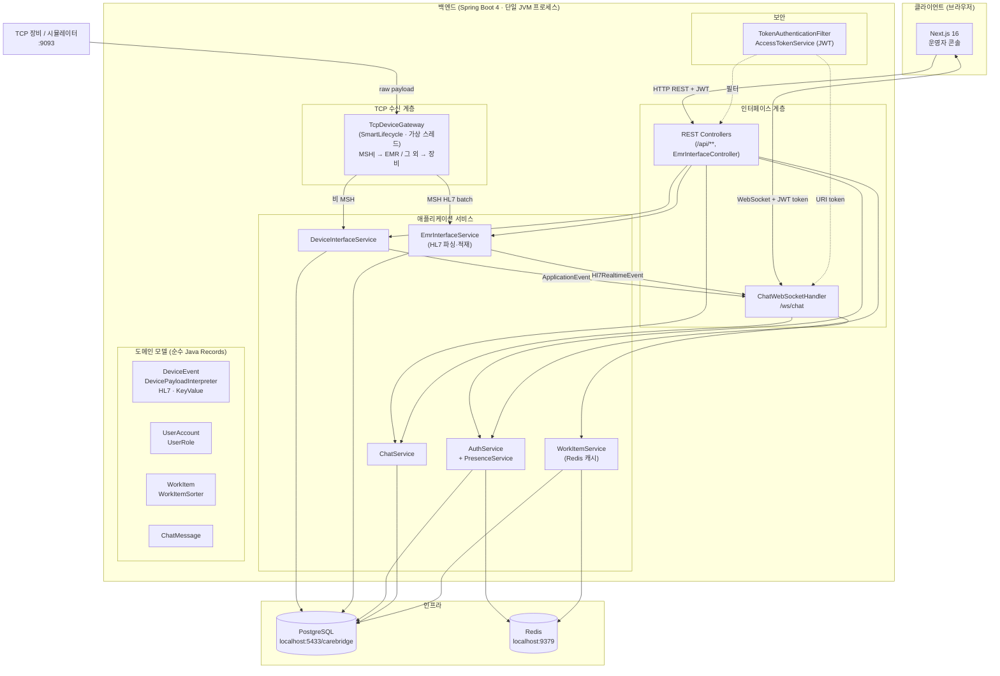
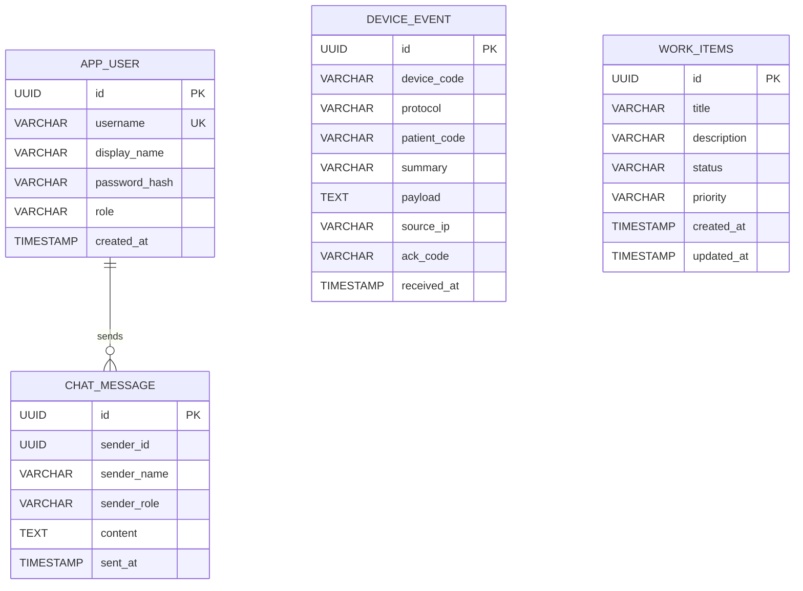
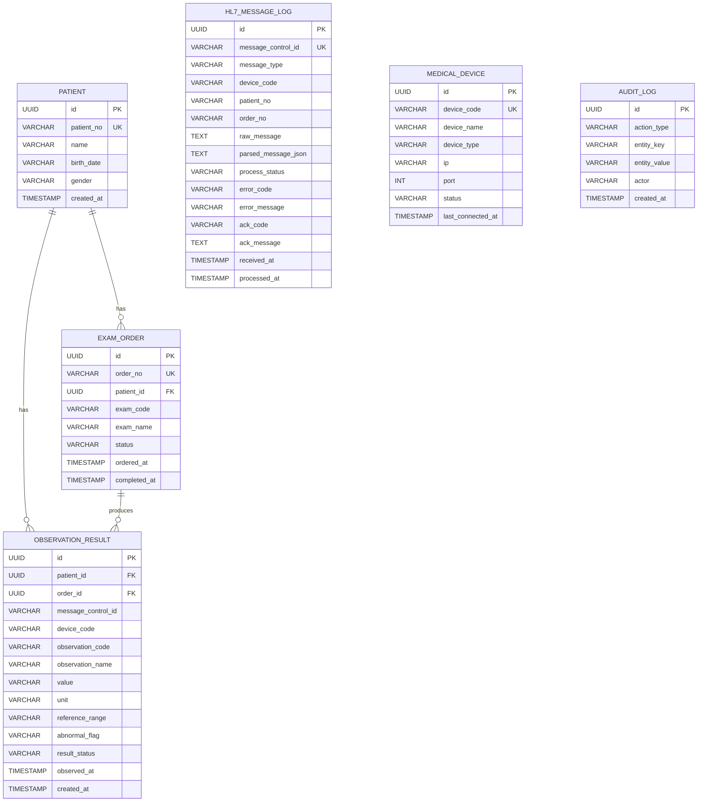
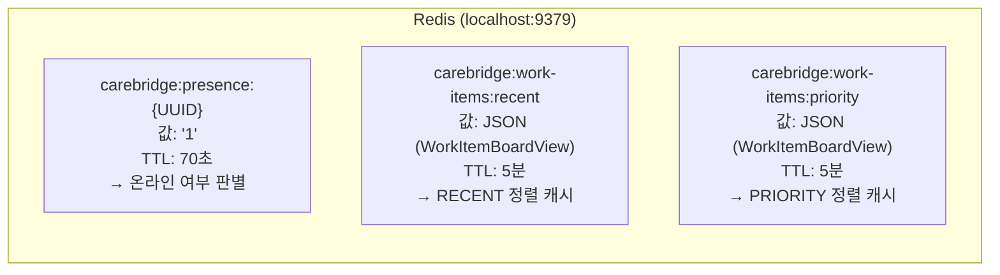
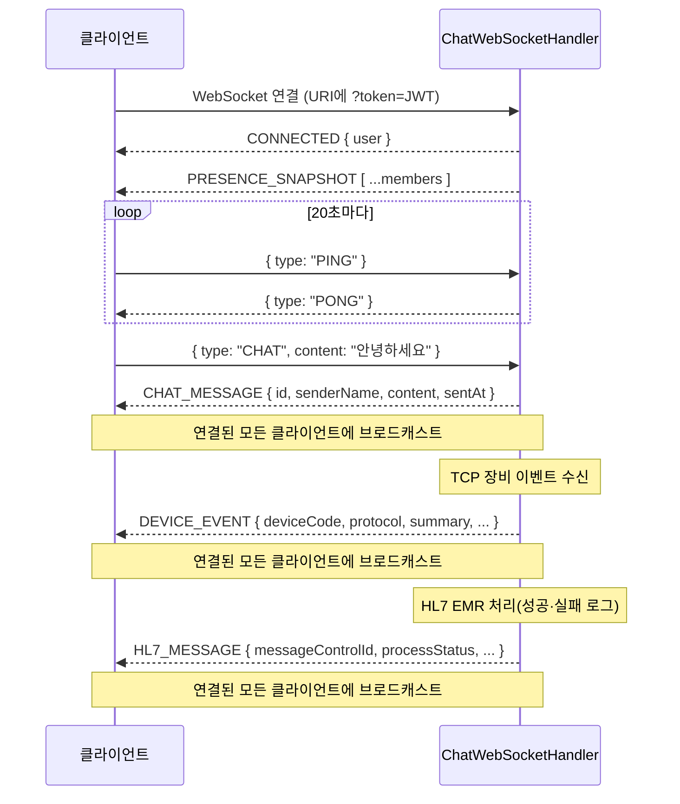
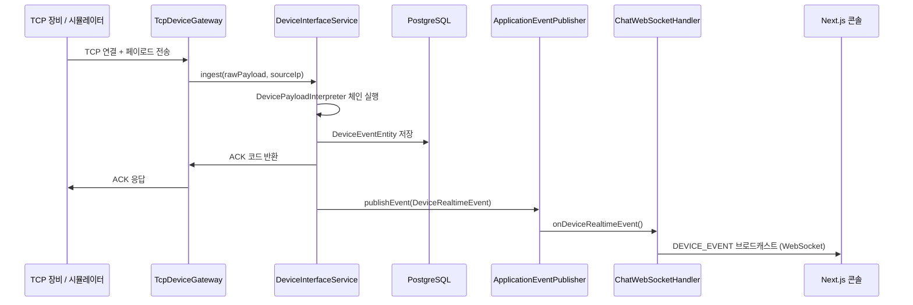
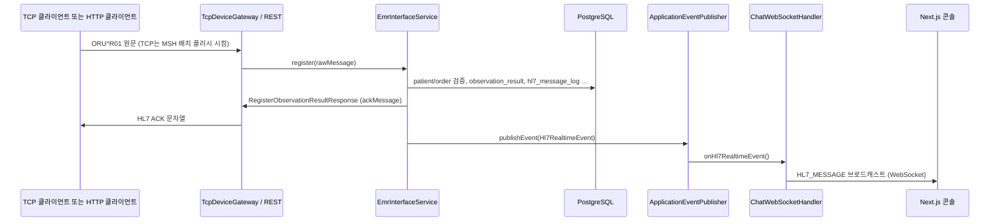

# CareBridge Platform


<br/>
<br/>
의료 장비·게이트웨이에서 들어오는 TCP 메시지를 수신·해석·저장하고, **HL7 ORU^R01** 스타일 검사 결과를 환자·검사오더와 매칭해 적재하며, 운영자 콘솔에서 실시간 채팅·접속자·장비 이벤트·HL7 처리 로그를 한 화면에서 볼 수 있게 만든 풀스택 샘플 프로젝트입니다.
<br/>
<br/>


<br/>


<br/>


<br/>

| 구분     | 기술                                                                                                                                                                                   |
| -------- | -------------------------------------------------------------------------------------------------------------------------------------------------------------------------------------- |
| Backend  | Java 25, **Spring Boot 4**, Spring Security (JWT), Spring Data JPA, Spring Data Redis, Spring WebSocket, Spring Validation, Spring Actuator, Lombok, PostgreSQL, 커스텀 TCP 게이트웨이 |
| Frontend | **Next.js 16** (App Router), **React 19**, TypeScript, Space Grotesk + Noto Sans KR, pnpm. React Compiler는 기본 비활성, `NEXT_REACT_COMPILER=1` 일 때만 `next.config.ts`에서 켜짐     |

### 문서·저장소 정합성 (제출 전 체크)

| 항목                   | 실제 저장소 기준                                                                                                                                                        |
| ---------------------- | ----------------------------------------------------------------------------------------------------------------------------------------------------------------------- |
| **JDK**                | `backend/build.gradle.kts` 의 `java { toolchain { languageVersion = … } }` 와 동일하게 README에 기재 (**현재 25**). Gradle은 이 저장소에서 수정하지 않고 문서만 맞춘다. |
| **프론트 폴더**        | **`frontend/`** (루트의 Next.js 앱). `web` 등 다른 폴더명은 사용하지 않음.                                                                                              |
| **Java 베이스 패키지** | `com.sleekydz86.carebridge.backend` — `com/intel3/...` 경로는 존재하지 않음.                                                                                            |
| **`interfaces.reset`** | HTTP 컨트롤러 패키지의 **디렉터리 이름**이 `reset` 이다(REST 약어가 아님). 리네이밍은 코드 변경 시 별도 작업.                                                           |

### 핵심 시나리오 (로컬 데모 ~1분)

1. (선택) 저장소 루트에서 `docker compose up -d` 로 PostgreSQL(5433)·Redis(9379) 기동
2. `backend` 에서 `./gradlew bootRun`(Windows: `gradlew.bat bootRun`) — HTTP 8080, TCP 9093, 내장 장비 시뮬레이터
3. `frontend` 에서 `pnpm install` 후 `pnpm dev` — `http://localhost:3000`
4. 시드 계정(예: `operator` / `Operator1234!`) 로그인 → 사이드바에서 **작업 보드**, **채팅**, **환자·HL7 로그·시뮬레이터** 등 전환
5. EMR: 시드 환자 `P0001`·오더 `ORD-001` 에 맞는 HL7 을 `POST /api/interface/hl7/messages` 또는 콘솔 시뮬레이터로 전송 → HL7 로그·검사 결과 반영 확인

---

## 목차

1. [왜 만들었나](#왜-만들었나)
2. [핵심 기능](#핵심-기능)
3. [전체 아키텍처](#전체-아키텍처)
4. [계층 설계 (백엔드)](#계층-설계-백엔드)
5. [ERD (데이터 모델)](#erd-데이터-모델)
6. [Redis 데이터 모델](#redis-데이터-모델)
7. [API 명세](#api-명세)
8. [WebSocket 프로토콜](#websocket-프로토콜)
9. [TCP 디바이스 프로토콜](#tcp-디바이스-프로토콜)
10. [EMR·HL7 인터페이스](#emrhl7-인터페이스)
11. [저장소 구조](#저장소-구조)
12. [사전 요구 사항](#사전-요구-사항)
13. [빠른 시작](#빠른-시작)
14. [포트 정리](#포트-정리)
15. [환경 변수](#환경-변수)
16. [내장 장비 시뮬레이터](#내장-장비-시뮬레이터)
17. [백엔드 테스트](#백엔드-테스트)
18. [실시간 데이터 흐름](#실시간-데이터-흐름)
19. [TCP 수동 테스트](#tcp-수동-테스트)
20. [보안·운영 참고](#보안운영-참고)
21. [라이선스 / 면책](#라이선스--면책)

---

## 왜 만들었나

병원·검사실 환경에서는 EMR만 쓰는 것이 아니라, 장비 전용 프로토콜(TCP, 키-밸류, HL7 스타일 등)으로 들어오는 데이터를 중간 계층에서 받아 정리해야 하는 경우가 많습니다.<br/>
이 프로젝트는 그 흐름을 단순화해 보여 주기 위해

- **동일 TCP 포트**에서 키-밸류·단순 HL7 라인은 장비 이벤트로, **`MSH`로 시작하는 HL7 배치**는 EMR 파이프라인(환자·오더 검증 → 검사결과 저장 → ACK)으로 분기하고
- 수신 결과를 **PostgreSQL에 영속화**한 뒤
- **WebSocket**으로 대시보드에 푸시하는

구조를 한 번에 구현했습니다.

---

## 핵심 기능

1. **장비 인터페이스 (TCP)**
   - 별도 포트 (`9093` 기본)에서 TCP 접속을 받고, 페이로드를 해석한 뒤 한 줄 ACK(또는 HL7 ACK 문자열)를 반환합니다.
   - 페이로드가 **`MSH|`로 시작**하면 `EmrInterfaceService`로 전달되어 ORU^R01 처리·DB 반영 후 **HL7 ACK**가 응답됩니다. 그 외는 기존처럼 **키-밸류 파이프(`|`)**와 **장비용 HL7 스타일** 인터프리터(`DevicePayloadInterpreter`) 체인으로 `device_event`에 적재됩니다.
   - HL7 배치는 줄 단위로 버퍼링되다가 **빈 줄**을 만나면 플러시되며, `MSH`가 아닌 메시지는 라인 단위로도 플러시됩니다.
   - 가상 스레드 (`Executors.newVirtualThreadPerTaskExecutor`) 기반 비동기 클라이언트 처리.

2. **저장 및 개요 API**
   - 장비 이벤트를 JPA로 저장하고, 최근 25건·총 건수·마지막 수신 시각 등을 REST로 제공합니다.

3. **실시간 운영 콘솔 (Next.js)**
   - 로그인/회원가입 후 JWT Bearer 토큰으로 보호된 REST API 호출.
   - WebSocket (`/ws/chat`)으로 채팅 메시지, 접속자 목록 갱신, **신규 장비 이벤트**, **HL7 메시지 로그 갱신**(`HL7_MESSAGE`)을 수신합니다.
   - 환자 목록·상세, 검사오더, HL7 수신 로그, 의료장비 목록, ORU 시뮬레이션 등 EMR 뷰를 콘솔에서 조회합니다.
   - `useEffectEvent`·`startTransition` 등 React 19 신규 API를 적극 활용한 상태 관리.

4. **Presence (접속 상태)**
   - Redis 기반 TTL 키(`carebridge:presence:{userId}`, TTL 70초)로 온라인/오프라인을 표시합니다.
   - 클라이언트가 20초마다 PING을 보내 TTL을 갱신합니다.

5. **내장 장비 시뮬레이터**
   - 백엔드 기동 후 `initialDelayMillis`(기본 5초) 뒤 `intervalMillis`(기본 7초) 간격으로 로컬 TCP 포트로 샘플 페이로드를 전송합니다.
   - UI 없이도 end-to-end 흐름을 즉시 확인할 수 있습니다.

6. **작업 보드 (Work Items)**
   - 칸반 스타일 작업 항목 CRUD API (`POST / PATCH / GET /api/work-items`).
   - 목록 조회 결과를 Redis에 5분간 캐싱하고, 생성·상태변경 시 캐시를 자동 무효화합니다.
   - 우선순위(PRIORITY)·최신순(RECENT) 두 가지 정렬 전략을 `WorkItemSorter` 전략 패턴으로 구현.

7. **데모 계정**
   - 최초 기동 시 시드: `admin` / `Admin1234!`, `operator` / `Operator1234!`

8. **EMR·HL7 (ORU^R01)**
   - 시드 환자 `P0001`, `P0002` 및 검사오더 `ORD-001`, `ORD-002`, 장비 `ECG-001`가 함께 생성됩니다.
   - HL7 수신 시 환자번호·오더번호를 검증하고, 성공 시 `observation_result` 저장·오더 완료·`hl7_message_log`·감사 로그를 남깁니다.
   - `POST /api/interface/hl7/messages`(본문 `text/plain`) 또는 TCP로 동일 파이프라인을 탈 수 있습니다.

---

## 전체 아키텍처



**한 줄 요약:** TCP에서 비 HL7 장비 페이로드는 파싱·저장(`device_event`) → `DeviceRealtimeEvent` → WebSocket `DEVICE_EVENT`. `MSH` HL7 배치는 EMR 서비스에서 검증·적재 → `Hl7RealtimeEvent` → WebSocket `HL7_MESSAGE`.

---

## 계층 설계 (백엔드)

백엔드는 **간결한 계층형 아키텍처**를 따릅니다.

```mermaid
graph LR
    subgraph interfaces["interfaces (어댑터)"]
        REST_C["REST (interfaces.reset)"]
        WS_H["WebSocket Handler"]
    end

    subgraph application["application (유스케이스 + JPA Entity + Repository)"]
        SVC["Service 클래스\n(AuthService, DeviceInterfaceService,\n EmrInterfaceService, ChatService, WorkItemService)"]
        ENT["JPA Entities\n(UserEntity, DeviceEventEntity,\n PatientEntity, ExamOrderEntity, …)"]
        REPO["Spring Data JPA Repositories"]
    end

    subgraph domain["domain (순수 비즈니스 규칙)"]
        REC["Java Records\n(UserAccount, DeviceEvent,\n ChatMessage, WorkItem)"]
        INTERP["Interpreter / Sorter / Factory"]
    end

    subgraph config["config + security"]
        CFG["AppProperties (ConfigurationProperties)"]
        SEC["SecurityConfig, WebSocketConfig,\n TokenAuthenticationFilter"]
    end

    interfaces --> application
    application --> domain
    config -.-> application & interfaces
```



| 패키지                                        | 역할                                                                                                                           |
| --------------------------------------------- | ------------------------------------------------------------------------------------------------------------------------------ |
| `interfaces.reset`                            | HTTP 컨트롤러 (`/api/auth`, `/api/device-interface`, EMR `/api/patients` 등). 패키지 디렉터리명은 **`reset`**(REST 오타 아님). |
| `interfaces.websocket`                        | WebSocket 핸들러, 메시지 라우팅, 이벤트 브로드캐스트                                                                           |
| `application.{auth,device,emr,chat,workitem}` | 유스케이스 서비스, JPA Entity, JPA Repository                                                                                  |
| `domain.{auth,device,chat,workitem}`          | 순수 도메인 Record, 팩토리, Interpreter, Sorter                                                                                |
| `config`                                      | Spring 설정 빈 (Security, CORS, WebSocket, ConfigurationProperties)                                                            |
| `security`                                    | JWT 발급·파싱, 인증 필터, UserPrincipal                                                                                        |

---

## ERD (데이터 모델)

PostgreSQL에는 운영 코어 테이블과 EMR 인터페이스용 테이블이 함께 생성됩니다.

### 운영 코어 (채팅·장비 이벤트·작업 보드)



### EMR·HL7 (`patient`, `exam_order`, `observation_result`, `hl7_message_log`, `medical_device`, `audit_log`)



> `hl7_message_log`·`medical_device`·`audit_log` 는 JPA 엔티티 기준으로 상기 필드를 갖으며, `ddl-auto: update` 로 스키마가 맞춰집니다. FK는 엔티티 연관에 맞게 생성되며 일부 테이블은 로그성으로 단독 적재됩니다.

> **참고:** `CHAT_MESSAGE.sender_id` 등은 JPA `@JoinColumn`/`@Column` 수준의 연관이며, DB 레벨 FK constraint는 일부 생략될 수 있습니다. `ddl-auto: update` 설정으로 애플리케이션 기동 시 테이블이 자동 생성·보완됩니다.

---

## Redis 데이터 모델



| Key 패턴                           | 용도               | TTL                      |
| ---------------------------------- | ------------------ | ------------------------ |
| `carebridge:presence:{userId}`     | 사용자 온라인 상태 | 70초 (PING으로 갱신)     |
| `carebridge:work-items:{sortType}` | WorkItem 목록 캐시 | 5분 (write 시 자동 삭제) |

---

## API 명세

### 인증 (`/api/auth`)

| Method | Path                 | 인증 | 설명                                                              |
| ------ | -------------------- | ---- | ----------------------------------------------------------------- |
| `POST` | `/api/auth/register` | X    | 회원가입. `username(3-30)`, `displayName(2-20)`, `password(8-40)` |
| `POST` | `/api/auth/login`    | X    | 로그인. Bearer 토큰 반환.                                         |
| `GET`  | `/api/auth/me`       | O    | 현재 로그인 사용자 정보                                           |
| `POST` | `/api/auth/logout`   | O    | 로그아웃 (Presence 해제)                                          |

**응답 예시 (로그인/회원가입):**

```json
{
  "accessToken": "eyJ...",
  "user": {
    "id": "550e8400-...",
    "username": "admin",
    "displayName": "관리자",
    "role": "ADMIN",
    "online": 1
  }
}
```

---

### 사용자 Presence (`/api/users`)

| Method | Path                       | 인증 | 설명                              |
| ------ | -------------------------- | ---- | --------------------------------- |
| `GET`  | `/api/users/presence`      | O    | 전체 멤버 + 온라인 상태 목록      |
| `POST` | `/api/users/presence/ping` | O    | Presence TTL 갱신 (20초마다 호출) |

---

### 채팅 (`/api/chat`)

| Method | Path                 | 인증 | 설명                                                                |
| ------ | -------------------- | ---- | ------------------------------------------------------------------- |
| `GET`  | `/api/chat/messages` | O    | 최근 채팅 메시지 목록 (페이지네이션, `page` 쿼리)                   |
| `POST` | `/api/chat/messages` | O    | 채팅 메시지 전송(JSON `{ "content" }`) — WebSocket 미연결 시 폴백용 |

권장: 연결된 클라이언트는 WebSocket으로 `{ "type": "CHAT", "content": "…" }` 전송 → 서버가 `CHAT_MESSAGE` 로 브로드캐스트합니다. 운영 콘솔은 WS 우선, 끊긴 경우 REST `POST` 로도 전송합니다.

---

### 장비 인터페이스 (`/api/device-interface`)

| Method | Path                                 | 인증    | 설명                                                                |
| ------ | ------------------------------------ | ------- | ------------------------------------------------------------------- |
| `GET`  | `/api/device-interface/overview`     | O       | TCP 포트·총 메시지 수·마지막 수신 시각·시뮬레이터 상태              |
| `GET`  | `/api/device-interface/events`       | O       | 최근 장비 이벤트 25건                                               |
| `POST` | `/api/device-interface/simulate`     | O ADMIN | 키-밸류 장비 페이로드 수동 인젝션 → `device_event` (`payload` 본문) |
| `POST` | `/api/device-interface/simulate/hl7` | O       | JSON으로 ORU^R01 템플릿 생성 후 EMR 파이프라인 실행                 |

**DeviceOverview 응답:**

```json
{
  "tcpPort": 9093,
  "totalMessages": 42,
  "lastReceivedAt": "2026-03-29T11:00:00",
  "simulatorEnabled": true,
  "simulatorIntervalMillis": 7000
}
```

**DeviceEvent 응답:**

```json
{
  "id": "...",
  "deviceCode": "VITAL-01",
  "protocol": "KEY_VALUE",
  "patientCode": "P-1001",
  "summary": "HEART_RATE=72, SPO2=98",
  "payload": "DEVICE=VITAL-01|PATIENT=P-1001|HEART_RATE=72|SPO2=98",
  "sourceIp": "127.0.0.1",
  "ackCode": "ACK-...",
  "receivedAt": "2026-03-29T11:00:00"
}
```

---

### 작업 보드 (`/api/work-items`)

| Method  | Path                            | 인증 | 설명                                           |
| ------- | ------------------------------- | ---- | ---------------------------------------------- |
| `POST`  | `/api/work-items`               | O    | 작업 항목 생성                                 |
| `GET`   | `/api/work-items?sortBy=RECENT` | O    | 목록 조회 (`RECENT` \| `PRIORITY`)             |
| `PATCH` | `/api/work-items/{id}/status`   | O    | 상태 변경 (`BACKLOG` → `IN_PROGRESS` → `DONE`) |

---

### EMR·HL7 (`/api/patients`, `/api/exam-orders`, `/api/interface/hl7`, `/api/devices`)

| Method | Path                                             | 인증 | 설명                                                     |
| ------ | ------------------------------------------------ | ---- | -------------------------------------------------------- |
| `GET`  | `/api/patients`                                  | O    | 환자 목록                                                |
| `GET`  | `/api/patients/{patientNo}`                      | O    | 환자 상세(오더·검사결과 포함)                            |
| `GET`  | `/api/exam-orders`                               | O    | 전체 검사오더                                            |
| `GET`  | `/api/patients/{patientNo}/exam-orders`          | O    | 환자별 검사오더                                          |
| `GET`  | `/api/patients/{patientNo}/observation-results`  | O    | 환자별 검사결과                                          |
| `GET`  | `/api/exam-orders/{orderNo}/observation-results` | O    | 오더별 검사결과                                          |
| `GET`  | `/api/devices`                                   | O    | 의료장비 목록                                            |
| `GET`  | `/api/interface/hl7/messages`                    | O    | HL7 수신 로그 최근 50건                                  |
| `GET`  | `/api/interface/hl7/messages/{messageControlId}` | O    | 단건 로그                                                |
| `POST` | `/api/interface/hl7/messages`                    | O    | 본문 `text/plain` 원문 HL7 수신·ACK 메타데이터 JSON 응답 |

`RegisterObservationResultResponse`에는 `messageControlId`, `status`(`SUCCESS`/`FAILED`), `savedResultCount`, 오류 시 `errorCode`/`message`, 그리고 **`ackMessage`**(TCP 응답으로 그대로 쓰는 HL7 ACK 문자열)가 포함됩니다.

---

## WebSocket 프로토콜

**엔드포인트:** `ws://localhost:8080/ws/chat?token={JWT}`



**서버 → 클라이언트 메시지 타입:**

| type                | 설명                                                   |
| ------------------- | ------------------------------------------------------ |
| `CONNECTED`         | 연결 성공, 현재 사용자 정보 포함                       |
| `PRESENCE_SNAPSHOT` | 전체 멤버 온라인 상태 목록                             |
| `CHAT_MESSAGE`      | 새 채팅 메시지 브로드캐스트                            |
| `DEVICE_EVENT`      | 새 장비 이벤트 브로드캐스트 (`device_event`)           |
| `HL7_MESSAGE`       | HL7 로그 적재·갱신 브로드캐스트 (`hl7_message_log` 뷰) |
| `PONG`              | PING 응답                                              |
| `ERROR`             | 오류 메시지                                            |

---

## TCP 디바이스 프로토콜

### Key-Value 형식 (기본)

```
DEVICE=VITAL-01|PATIENT=P-1001|HEART_RATE=72|SPO2=98|STATUS=READY
```

- `DEVICE` → `deviceCode`
- `PATIENT` → `patientCode`
- 나머지 키-밸류 쌍 → `summary`

### HL7 스타일

**한 줄(짧은 ORU 형태)** 은 TCP 수신 후 `device_event` 용 인터프리터 체인으로 들어가 요약·저장될 수 있습니다.

```
MSH|^~\&|HL7-GATEWAY-A|CAREBRIDGE|EMR|HOSPITAL|20260321153000||ORU^R01|MSG1|P|2.5
```

**멀티라인·EMR 적재** 는 `MSH` 로 시작하는 전체 배치가 `TcpDeviceGateway` 에서 `EmrInterfaceService` 로 직접 전달됩니다. 파서는 `PID-3` 환자번호, `OBR-2`(비어 있으면 `OBR-3`) 오더번호 등을 사용하므로, 데모 DB와 맞추려면 예를 들어 아래처럼 **`P0001` / `ORD-001`** 을 사용합니다.

```
MSH|^~\&|ECG-001|CAREBRIDGE|EMR|HOSPITAL|20260514103000||ORU^R01|MSG00001|P|2.5
PID|||P0001||HONG^GILDONG||19800101|M
OBR|1|ORD-001||ECG^심전도
OBX|1|NM|HR^Heart Rate||78|bpm|60-100|N
```

- `MSH[2]` or `MSH[3]` → `deviceCode`
- `PID[3]` → `patientCode`
- `OBX[5]` → `summary`

두 인터프리터는 `@Order` 어노테이션으로 우선순위 설정: **HL7(1) → Key-Value(2)**. 단, TCP로 들어온 메시지 **전체가 `MSH|`로 시작**하면 위 인터프리터를 거치지 않고 **EMR 서비스**로 보내져 `patient` / `exam_order` 검증 후 `observation_result`에 저장됩니다.

### EMR용 HL7 (ORU^R01, TCP·HTTP 공통)

- **지원 메시지:** `ORU^R01` (파서가 `MSH`·`PID`·`OBR`·`OBX`에서 환자·오더·검사값을 추출합니다.)
- **전제:** 시드 또는 사전 등록된 `patient.patient_no`와 `exam_order.order_no`가 존재하고, 오더가 취소 상태가 아니어야 합니다. 데모 데이터 예: 환자 `P0001` / 오더 `ORD-001`.
- **중복:** 동일 `messageControlId`는 거절(`DUPLICATE_MESSAGE`)됩니다.
- **TCP 응답:** 성공·실패 모두 `ackMessage` 문자열이 한 줄 이상으로 기록되며, 게이트웨이가 소켓으로 그대로 flush 합니다.
- **HTTP:** `POST /api/interface/hl7/messages`에 `Content-Type: text/plain`으로 원문을 넣으면 동일 처리·JSON 응답을 받습니다.

---

## EMR·HL7 인터페이스

요약하면 **검사 장비 → (TCP 또는 HTTP) → HL7 파싱 → DB 반영 → ACK → WebSocket `HL7_MESSAGE`** 흐름입니다. 장비 시뮬레이터가 보내는 짧은 HL7 한 줄은 여전히 `device_event`용 인터프리터가 처리할 수 있으나, **멀티라인 `MSH` 배치**는 EMR 쪽으로 분기됩니다.

---

## 저장소 구조

```
carebridge-platform/
├── README.md
├── docker-compose.yml                       # 로컬 PostgreSQL(5433)·Redis(9379) — 선택
├── backend/                                 # Spring Boot 4 — HTTP :8080, TCP :9093
│   ├── build.gradle.kts
│   ├── gradlew / gradlew.bat
│   └── src/main/java/com/sleekydz86/carebridge/backend/
│       ├── BackendApplication.java          # 진입점
│       ├── global/config/                   # Security, WebSocket, DemoDataInitializer, AppProperties …
│       ├── global/security/                 # JWT, TokenAuthenticationFilter …
│       ├── server/domain/                   # 순수 도메인 (auth, device, chat, workitem)
│       ├── server/application/
│       │   ├── auth/ | device/ | chat/ | workitem/
│       │   └── emr/                         # EMR·HL7: EmrInterfaceService, 파서, 엔티티, 리포지토리
│       └── server/interfaces/
│           ├── reset/                       # REST 컨트롤러 (Auth, Device, WorkItem, Chat, User …)
│           ├── reset/emr/EmrInterfaceController.java
│           └── websocket/ChatWebSocketHandler.java
│
└── frontend/                                # Next.js 16 (App Router)
    ├── package.json
    └── src/
        ├── app/                             # layout, page, globals.css
        └── features/
            ├── chat/                        # 채팅 패널 UI
            ├── console/                     # 운영 콘솔 (로그인, 작업 보드, 채팅, EMR·HL7, WebSocket)
            └── work-items/                  # 작업 보드
```

---

## 사전 요구 사항

| 항목       | 버전 / 설정                                                     |
| ---------- | --------------------------------------------------------------- |
| JDK        | **25** (`backend/build.gradle.kts` 의 `java.toolchain` 과 동일) |
| PostgreSQL | 호스트 `localhost`, 포트 **`5433`**, DB `carebridge`            |
| Redis      | `localhost:9379`, 비밀번호 `123456`                             |
| Node.js    | LTS 20+                                                         |
| pnpm       | `npm install -g pnpm`                                           |

---

## 빠른 시작

### 0) (선택) PostgreSQL·Redis만 Docker로

저장소 루트(`carebridge-platform/`)에서:

```powershell
docker compose up -d
```

- PostgreSQL: `localhost:5433`, DB `carebridge`, 사용자/비밀번호 `postgres` / `postgres`
- Redis: `localhost:9379`, 비밀번호 `123456`

애플리케이션의 `application.yml` 기본값과 맞춰 두었습니다.

### 1) 백엔드

```powershell
cd carebridge-platform/backend
.\gradlew.bat bootRun
```

- HTTP API: `http://localhost:8080`
- TCP 장비 수신: `localhost:9093` (동일 JVM 프로세스)
- 시작 약 5초 후 내장 시뮬레이터가 자동으로 장비 메시지를 전송합니다.

### 2) 프론트엔드

```powershell
cd carebridge-platform/frontend
pnpm install
pnpm dev
```

브라우저에서 `http://localhost:3000` — 시드 계정으로 로그인하면 콘솔이 열립니다.

기본 API/WS 주소는 `http://localhost:8080`입니다. HTTP 포트를 바꾼 경우:

```powershell
$env:NEXT_PUBLIC_API_BASE_URL='http://localhost:8081'
$env:NEXT_PUBLIC_WS_BASE_URL='ws://localhost:8081/ws/chat'
pnpm dev
```

---

## 포트 정리

| 포트   | 용도                                               |
| ------ | -------------------------------------------------- |
| `3000` | Next.js 개발 서버                                  |
| `5433` | PostgreSQL                                         |
| `8080` | Spring Boot (REST, Actuator, WebSocket 업그레이드) |
| `9093` | TCP 장비 메시지 수신 (기본값)                      |
| `9379` | Redis                                              |

포트 확인 (PowerShell):

```powershell
Get-NetTCPConnection -LocalPort 8080,9093 -State Listen
```

---

## 환경 변수

| 환경 변수                                 | 기본값                        | 설명                               |
| ----------------------------------------- | ----------------------------- | ---------------------------------- |
| `POSTGRES_HOST`                           | `localhost`                   | PostgreSQL 호스트                  |
| `POSTGRES_PORT`                           | `5433`                        | PostgreSQL 포트                    |
| `POSTGRES_DB`                             | `carebridge`                  | DB 이름                            |
| `POSTGRES_USERNAME`                       | `postgres`                    | DB 사용자                          |
| `POSTGRES_PASSWORD`                       | `postgres`                    | DB 비밀번호                        |
| `REDIS_HOST`                              | `localhost`                   | Redis 호스트                       |
| `REDIS_PORT`                              | `9379`                        | Redis 포트                         |
| `REDIS_PASSWORD`                          | `123456`                      | Redis 비밀번호                     |
| `APP_TOKEN_SECRET`                        | _(기본값)_                    | **프로덕션 필수 교체** JWT 서명 키 |
| `SERVER_PORT`                             | `8080`                        | HTTP 서버 포트                     |
| `TCP_SERVER_PORT`                         | `9093`                        | TCP 수신 포트                      |
| `DEVICE_SIMULATOR_ENABLED`                | `true`                        | 시뮬레이터 활성화                  |
| `DEVICE_SIMULATOR_HOST`                   | `127.0.0.1`                   | 시뮬레이터 타겟 호스트             |
| `DEVICE_SIMULATOR_PORT`                   | `9093`                        | 시뮬레이터 타겟 포트               |
| `DEVICE_SIMULATOR_INTERVAL_MILLIS`        | `7000`                        | 메시지 전송 간격 (ms)              |
| `DEVICE_SIMULATOR_INITIAL_DELAY_MILLIS`   | `5000`                        | 최초 전송 지연 (ms)                |
| `DEVICE_SIMULATOR_CONNECT_TIMEOUT_MILLIS` | `5000`                        | 시뮬레이터 TCP 연결 타임아웃 (ms)  |
| `DEVICE_SIMULATOR_READ_TIMEOUT_MILLIS`    | `30000`                       | 시뮬레이터 ACK 읽기 타임아웃 (ms)  |
| `NEXT_PUBLIC_API_BASE_URL`                | `http://localhost:8080`       | 프론트 → 백엔드 REST 주소          |
| `NEXT_PUBLIC_WS_BASE_URL`                 | `ws://localhost:8080/ws/chat` | 프론트 → 백엔드 WS 주소            |

HTTP 포트를 `8081`, TCP를 `9094`로 변경하는 예:

```powershell
cd carebridge-platform/backend
$env:SERVER_PORT='8081'
$env:TCP_SERVER_PORT='9094'
$env:DEVICE_SIMULATOR_PORT='9094'
.\gradlew.bat bootRun
```

---

## 내장 장비 시뮬레이터

기동 약 5초 후 아래 샘플 페이로드들이 순환하며 전송됩니다. (키-밸류와 짧은 HL7/ORU 형태가 섞입니다. EMR DB에 매칭되는 `P0001` / `ORD-001` 검증 흐름은 콘솔의 **HL7 시뮬레이션** 또는 `POST /api/interface/hl7/messages`로 확인하는 것이 확실합니다.)

```
DEVICE=VITAL-01|PATIENT=P-1001|HEART_RATE=72|SPO2=98|TEMP=36.8|STATUS=STEADY
DEVICE=XRAY-02|PATIENT=P-1002|RESULT=CLEAR|DOSE=1.2mSv|STATUS=COMPLETE
DEVICE=ECG-03|PATIENT=P-1003|RHYTHM=SINUS|RATE=68|QRS=0.09s|STATUS=NORMAL
MSH|^~\&|HL7-GATEWAY-A|CAREBRIDGE|EMR|HOSPITAL|...  (HL7 스타일)
```

시뮬레이터를 끄고 싶으면:

```powershell
$env:DEVICE_SIMULATOR_ENABLED='false'
.\gradlew.bat bootRun
```

## 백엔드 테스트

- **현재:** `backend/src/test/java/com/sleekydz86/carebridge/backend/BackendApplicationTests.java` — 애플리케이션 컨텍스트 기동 스모크.
- **권장:** `Hl7MessageParser`(세그먼트·`messageControlId`·다중 OBX), `EmrInterfaceService`(정상 적재·중복 `messageControlId`·미등록 환자/오더·ACK 분기), TCP `MSH|` vs 키-밸류 라우팅에 대한 단위·통합 테스트를 단계적으로 추가하면 포트폴리오 신뢰도가 올라갑니다.

---

## 실시간 데이터 흐름

### 장비 이벤트 (`device_event`, 비 MSH TCP 페이로드)

키-밸류·장비용 HL7 한 줄 등은 **동일 TCP 포트**에서 `DeviceInterfaceService`로 들어갑니다.



### EMR HL7 (`MSH` 배치 또는 HTTP `text/plain`)



---

## TCP 수동 테스트

1. 리스닝 확인: `Get-NetTCPConnection -LocalPort 9093 -State Listen` (PowerShell).
2. 연결 확인: `Test-NetConnection 127.0.0.1 -Port 9093`.
3. **키-밸류:** 한 줄 전송 후 서버가 반환하는 짧은 ACK 문자열을 확인합니다.
4. **EMR HL7:** `MSH|`로 시작하는 메시지는 줄 단위로 버퍼링되므로, 샘플은 세그먼트를 모두 보낸 뒤 **빈 줄**로 배치를 끝내거나 연결을 종료해 플러시합니다. 로그인 토큰이 있다면 `POST /api/interface/hl7/messages`로 동일 본문을 올려 ACK JSON을 확인하는 편이 간단합니다.

---

## 보안·운영 참고

- REST API는 **JWT (Bearer)** 기반 stateless 인증입니다. (`/api/auth/**`와 일부 Actuator 경로 제외.)
- WebSocket은 연결 URI의 `?token=` 쿼리 파라미터에서 토큰을 추출해 검증합니다.
- `POST /api/device-interface/simulate`는 `ROLE_ADMIN`만 호출 가능합니다. `POST /api/device-interface/simulate/hl7`는 **인증된 사용자**(ADMIN·OPERATOR)면 호출 가능합니다.
- `POST /api/interface/hl7/messages` 및 EMR 조회 API도 동일하게 **Bearer 토큰**이 필요합니다. 외부 시스템 연동 시 별도 서비스 계정·MLLP·IP 제한 등을 고려하세요.
- **프로덕션에서는 `APP_TOKEN_SECRET` 등 시크릿을 반드시 교체**하세요.
- Actuator 엔드포인트 노출 범위: `health`, `info`, `metrics` (기본).

---

## 라이선스 / 면책

실제 의료기기·HL7 연동·규제 요구사항을 대체하지 않습니다.
