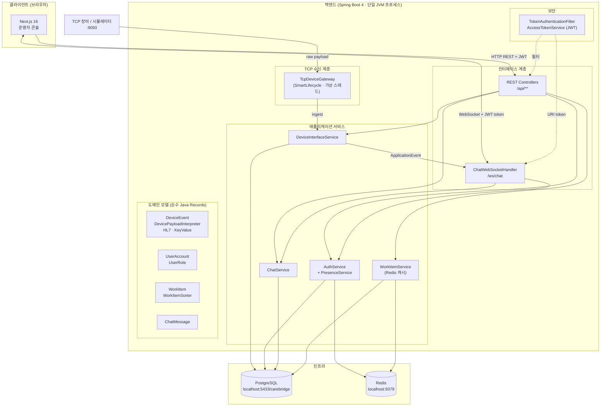
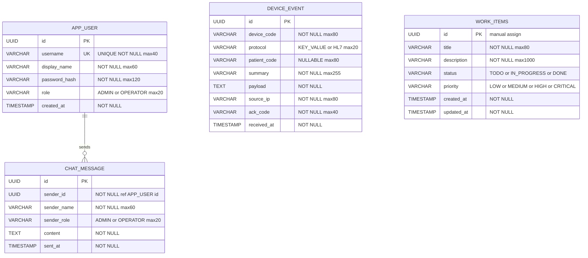
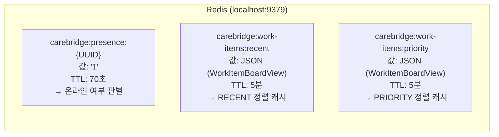
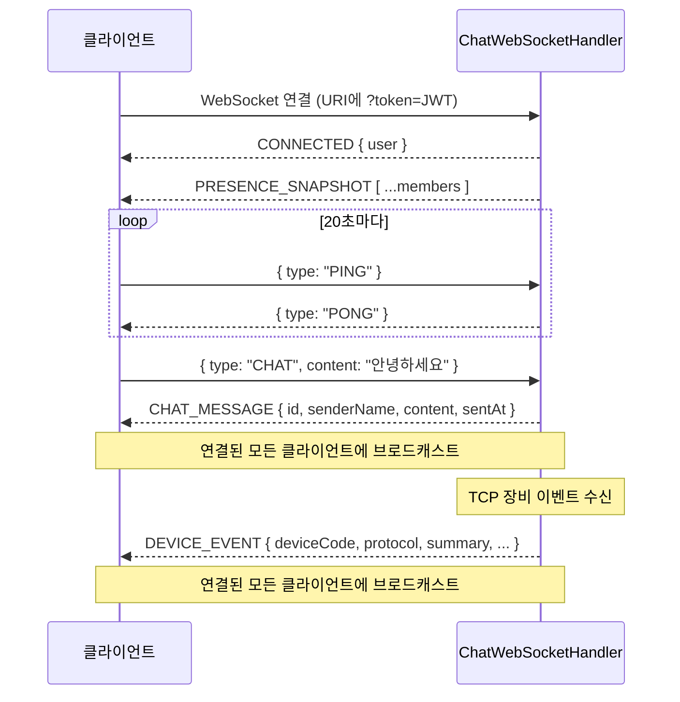
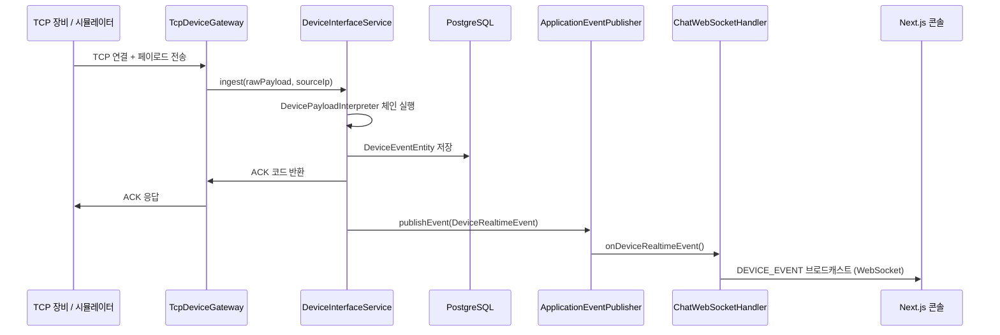

# CareBridge Platform


<br/>
<br/>
의료 장비·게이트웨이에서 들어오는 TCP 메시지를 수신·해석·저장하고, 운영자 콘솔에서 실시간 채팅·접속자·장비 이벤트를 한 화면에서 볼 수 있게 만든 풀스택 샘플 프로젝트 입니다.
<br/>
<br/>


| 구분 | 기술 |
|------|------|
| Backend | Java 21, **Spring Boot 4**, Spring Security (JWT), Spring Data JPA, Spring Data Redis, Spring WebSocket, Spring Validation, Spring Actuator, Lombok, PostgreSQL, 커스텀 TCP 게이트웨이 |
| Frontend | **Next.js 16** (App Router), **React 19**, TypeScript, Space Grotesk + Noto Sans KR, pnpm |

---

## 목차

1. [왜 만들었나](#왜-만들었나)
2. [핵심 기능](#핵심-기능)
3. [전체 아키텍처](#전체-아키텍처)
4. [계층 설계 (백엔드)](#계층-설계-백엔드)
5. [ERD (데이터 모델)](#erd-데이터-모델)
6. [Redis 데이터 모델](#redis-데이터-모델)
7. [API 명세](#api-명세)
8. [WebSocket 프로토콜](#websocket-프로토콜)
9. [TCP 디바이스 프로토콜](#tcp-디바이스-프로토콜)
10. [저장소 구조](#저장소-구조)
11. [사전 요구 사항](#사전-요구-사항)
12. [빠른 시작](#빠른-시작)
13. [포트 정리](#포트-정리)
14. [환경 변수](#환경-변수)
15. [내장 장비 시뮬레이터](#내장-장비-시뮬레이터)
16. [TCP 수동 테스트](#tcp-수동-테스트)
17. [보안·운영 참고](#보안운영-참고)
18. [라이선스 / 면책](#라이선스--면책)

---

## 왜 만들었나

병원·검사실 환경에서는 EMR만 쓰는 것이 아니라, 장비 전용 프로토콜(TCP, 키-밸류, HL7 스타일 등)으로 들어오는 데이터를 중간 계층에서 받아 정리해야 하는 경우가 많습니다.<br/>
이 프로젝트는 그 흐름을 단순화해 보여 주기 위해

- 동일한 수신 경로로 실제 TCP 클라이언트와 내장 시뮬레이터 트래픽을 처리하고
- 수신 결과를 **PostgreSQL에 영속화**한 뒤
- **WebSocket**으로 대시보드에 푸시하는

구조를 한 번에 구현했습니다.

---

## 핵심 기능

1. **장비 인터페이스 (TCP)**  
   - 별도 포트 (`9093` 기본)에서 TCP 접속을 받고, 페이로드를 해석한 뒤 ACK를 반환합니다.  
   - **키-밸류 파이프(`|`) 형식**과 **HL7 스타일** 두 가지 인터프리터를 지원하며, 인터페이스(`DevicePayloadInterpreter`) 구현만으로 확장할 수 있습니다.
   - 가상 스레드 (`Executors.newVirtualThreadPerTaskExecutor`) 기반 비동기 클라이언트 처리.

2. **저장 및 개요 API**  
   - 장비 이벤트를 JPA로 저장하고, 최근 25건·총 건수·마지막 수신 시각 등을 REST로 제공합니다.

3. **실시간 운영 콘솔 (Next.js)**  
   - 로그인/회원가입 후 JWT Bearer 토큰으로 보호된 REST API 호출.  
   - WebSocket (`/ws/chat`)으로 채팅 메시지, 접속자 목록 갱신, **신규 장비 이벤트 브로드캐스트**를 수신합니다.
   - `useEffectEvent`·`startTransition` 등 React 19 신규 API를 적극 활용한 상태 관리.

4. **Presence (접속 상태)**  
   - Redis 기반 TTL 키(`carebridge:presence:{userId}`, TTL 70초)로 온라인/오프라인을 표시합니다.
   - 클라이언트가 20초마다 PING을 보내 TTL을 갱신합니다.

5. **내장 장비 시뮬레이터**  
   - 백엔드 기동 후 `initialDelayMillis`(기본 5초) 뒤 `intervalMillis`(기본 7초) 간격으로 로컬 TCP 포트로 샘플 페이로드를 전송합니다.
   - UI 없이도 end-to-end 흐름을 즉시 확인할 수 있습니다.

6. **작업 보드 (Work Items)**  
   - 칸반 스타일 작업 항목 CRUD API (`POST / PATCH / GET /api/work-items`).
   - 목록 조회 결과를 Redis에 5분간 캐싱하고, 생성·상태변경 시 캐시를 자동 무효화합니다.
   - 우선순위(PRIORITY)·최신순(RECENT) 두 가지 정렬 전략을 `WorkItemSorter` 전략 패턴으로 구현.

7. **데모 계정**  
   - 최초 기동 시 시드: `admin` / `Admin1234!`, `operator` / `Operator1234!`

---

## 전체 아키텍처



**한 줄 요약:** TCP → 파싱·저장(PostgreSQL) → Spring ApplicationEvent → WebSocket 브로드캐스트로 콘솔 실시간 갱신.

---

## 계층 설계 (백엔드)

백엔드는 **간결한 계층형 아키텍처**를 따릅니다.

```mermaid
graph LR
    subgraph interfaces["interfaces (어댑터)"]
        REST_C["REST Controllers"]
        WS_H["WebSocket Handler"]
    end

    subgraph application["application (유스케이스 + JPA Entity + Repository)"]
        SVC["Service 클래스\n(AuthService, DeviceInterfaceService,\n ChatService, WorkItemService)"]
        ENT["JPA Entities\n(UserEntity, DeviceEventEntity,\n ChatMessageEntity, WorkItemEntity)"]
        REPO["Spring Data JPA Repositories"]
    end

    subgraph domain["domain (순수 비즈니스 규칙)"]
        REC["Java Records\n(UserAccount, DeviceEvent,\n ChatMessage, WorkItem)"]
        INTERP["Interpreter / Sorter / Factory"]
    end

    subgraph config["config + security"]
        CFG["AppProperties (ConfigurationProperties)"]
        SEC["SecurityConfig, WebSocketConfig,\n TokenAuthenticationFilter"]
    end

    interfaces --> application
    application --> domain
    config -.-> application & interfaces
```



| 패키지 | 역할 |
|--------|------|
| `interfaces.rest` | HTTP 컨트롤러, 요청·응답 DTO (inner record) |
| `interfaces.websocket` | WebSocket 핸들러, 메시지 라우팅, 이벤트 브로드캐스트 |
| `application.{auth,device,chat,workitem}` | 유스케이스 서비스, JPA Entity, JPA Repository |
| `domain.{auth,device,chat,workitem}` | 순수 도메인 Record, 팩토리, Interpreter, Sorter |
| `config` | Spring 설정 빈 (Security, CORS, WebSocket, ConfigurationProperties) |
| `security` | JWT 발급·파싱, 인증 필터, UserPrincipal |

---

## ERD (데이터 모델)

PostgreSQL에 생성되는 4개 테이블의 관계입니다.



    

> **참고:** `CHAT_MESSAGE.sender_id`는 JPA `@Column`으로 선언된 논리적 외래키이며, DB 레벨 FK constraint는 선언하지 않았습니다. `ddl-auto: update` 설정으로 애플리케이션 기동 시 테이블이 자동 생성/보완됩니다.

---

## Redis 데이터 모델



| Key 패턴 | 용도 | TTL |
|----------|------|-----|
| `carebridge:presence:{userId}` | 사용자 온라인 상태 | 70초 (PING으로 갱신) |
| `carebridge:work-items:{sortType}` | WorkItem 목록 캐시 | 5분 (write 시 자동 삭제) |

---

## API 명세

### 인증 (`/api/auth`)

| Method | Path | 인증 | 설명 |
|--------|------|------|------|
| `POST` | `/api/auth/register` | X | 회원가입. `username(3-30)`, `displayName(2-20)`, `password(8-40)` |
| `POST` | `/api/auth/login` | X | 로그인. Bearer 토큰 반환. |
| `GET` | `/api/auth/me` | O | 현재 로그인 사용자 정보 |
| `POST` | `/api/auth/logout` | O | 로그아웃 (Presence 해제) |

**응답 예시 (로그인/회원가입):**
```json
{
  "accessToken": "eyJ...",
  "user": {
    "id": "550e8400-...",
    "username": "admin",
    "displayName": "관리자",
    "role": "ADMIN",
    "online": 1
  }
}
```

---

### 사용자 Presence (`/api/users`)

| Method | Path | 인증 | 설명 |
|--------|------|------|------|
| `GET` | `/api/users/presence` | O | 전체 멤버 + 온라인 상태 목록 |
| `POST` | `/api/users/presence/ping` | O | Presence TTL 갱신 (20초마다 호출) |

---

### 채팅 (`/api/chat`)

| Method | Path | 인증 | 설명 |
|--------|------|------|------|
| `GET` | `/api/chat/messages` | O | 최근 채팅 메시지 목록 (최대 50건) |

> 채팅 **전송**은 WebSocket(`CHAT` 타입 메시지)으로만 가능합니다.

---

### 장비 인터페이스 (`/api/device-interface`)

| Method | Path | 인증 | 설명 |
|--------|------|------|------|
| `GET` | `/api/device-interface/overview` | O | TCP 포트·총 메시지 수·마지막 수신 시각·시뮬레이터 상태 |
| `GET` | `/api/device-interface/events` | O | 최근 장비 이벤트 25건 |
| `POST` | `/api/device-interface/simulate` | O ADMIN | 페이로드 직접 인젝션 (시뮬레이션) |

**DeviceOverview 응답:**
```json
{
  "tcpPort": 9093,
  "totalMessages": 42,
  "lastReceivedAt": "2026-03-29T11:00:00",
  "simulatorEnabled": true,
  "simulatorIntervalMillis": 7000
}
```

**DeviceEvent 응답:**
```json
{
  "id": "...",
  "deviceCode": "VITAL-01",
  "protocol": "KEY_VALUE",
  "patientCode": "P-1001",
  "summary": "HEART_RATE=72, SPO2=98",
  "payload": "DEVICE=VITAL-01|PATIENT=P-1001|HEART_RATE=72|SPO2=98",
  "sourceIp": "127.0.0.1",
  "ackCode": "ACK-...",
  "receivedAt": "2026-03-29T11:00:00"
}
```

---

### 작업 보드 (`/api/work-items`)

| Method | Path | 인증 | 설명 |
|--------|------|------|------|
| `POST` | `/api/work-items` | O | 작업 항목 생성 |
| `GET` | `/api/work-items?sortBy=RECENT` | O | 목록 조회 (`RECENT` \| `PRIORITY`) |
| `PATCH` | `/api/work-items/{id}/status` | O | 상태 변경 (`TODO`→`IN_PROGRESS`→`DONE`) |

---

## WebSocket 프로토콜

**엔드포인트:** `ws://localhost:8080/ws/chat?token={JWT}`



**서버 → 클라이언트 메시지 타입:**

| type | 설명 |
|------|------|
| `CONNECTED` | 연결 성공, 현재 사용자 정보 포함 |
| `PRESENCE_SNAPSHOT` | 전체 멤버 온라인 상태 목록 |
| `CHAT_MESSAGE` | 새 채팅 메시지 브로드캐스트 |
| `DEVICE_EVENT` | 새 장비 이벤트 브로드캐스트 |
| `PONG` | PING 응답 |
| `ERROR` | 오류 메시지 |

---

## TCP 디바이스 프로토콜

### Key-Value 형식 (기본)

```
DEVICE=VITAL-01|PATIENT=P-1001|HEART_RATE=72|SPO2=98|STATUS=READY
```

- `DEVICE` → `deviceCode`
- `PATIENT` → `patientCode`
- 나머지 키-밸류 쌍 → `summary`

### HL7 스타일

```
MSH|^~\&|HL7-GATEWAY-A|CAREBRIDGE|EMR|HOSPITAL|20260321153000||ORU^R01|MSG1|P|2.5
PID|1||P-2001||SIMULATED^PATIENT
OBR|1||LAB1|GLUCOSE^Glucose
OBX|1|NM|GLUCOSE^Glucose||5.6|mmol/L|3.5-7.8|N
```

- `MSH[2]` or `MSH[3]` → `deviceCode`
- `PID[3]` → `patientCode`
- `OBX[5]` → `summary`

두 인터프리터는 `@Order` 어노테이션으로 우선순위 설정: **HL7(1) → Key-Value(2)**.

---

## 저장소 구조

```
carebridgeplatform2/
├── README.md
│
├── backend/                              # Spring Boot 4 (HTTP :8080 + TCP :9093)
│   ├── build.gradle.kts                  # 빌드 설정 (Java 21, Spring Boot 4.0.4)
│   ├── settings.gradle.kts
│   ├── gradlew / gradlew.bat
│   └── src/main/
│       ├── resources/
│       │   └── application.yml          # 설정 (DB, Redis, JWT, TCP, 시뮬레이터)
│       └── java/com/intel3/carebridge/server/
│           ├── CarebridgeServerApplication.java   # @SpringBootApplication 진입점
│           ├── config/
│           │   ├── AppProperties.java             # @ConfigurationProperties(prefix="app")
│           │   ├── DemoDataInitializer.java        # 시드 계정 생성
│           │   ├── SecurityConfig.java            # Spring Security + JWT 필터
│           │   ├── WebConfig.java                 # CORS 설정
│           │   └── WebSocketConfig.java           # WebSocket 등록
│           ├── security/
│           │   ├── AccessTokenService.java        # JWT 발급·파싱
│           │   ├── AuthenticatedUserPrincipal.java
│           │   └── TokenAuthenticationFilter.java
│           ├── domain/
│           │   ├── auth/
│           │   │   ├── UserAccount.java           # 도메인 Record
│           │   │   ├── UserAccountFactory.java
│           │   │   └── UserRole.java              # ADMIN | OPERATOR
│           │   ├── device/
│           │   │   ├── DeviceEvent.java           # 도메인 Record
│           │   │   ├── DeviceEventFactory.java
│           │   │   ├── DeviceProtocol.java        # KEY_VALUE | HL7
│           │   │   ├── DevicePayloadInterpreter.java   # 인터페이스
│           │   │   ├── KeyValuePayloadInterpreter.java # @Order(2)
│           │   │   ├── Hl7PayloadInterpreter.java      # @Order(1)
│           │   │   └── InterpretedDevicePayload.java
│           │   ├── chat/
│           │   │   ├── ChatMessage.java
│           │   │   └── ChatMessageFactory.java
│           │   └── workitem/
│           │       ├── WorkItem.java              # 도메인 Record (불변)
│           │       ├── WorkItemFactory.java
│           │       ├── WorkItemStatus.java        # TODO | IN_PROGRESS | DONE
│           │       ├── WorkItemPriority.java      # LOW | MEDIUM | HIGH | CRITICAL
│           │       ├── WorkItemSortType.java      # RECENT | PRIORITY
│           │       ├── WorkItemSorter.java        # 전략 인터페이스
│           │       ├── RecentWorkItemSorter.java
│           │       ├── PriorityWorkItemSorter.java
│           │       └── WorkItemNotFoundException.java
│           ├── application/
│           │   ├── auth/
│           │   │   ├── AuthService.java           # 회원가입·로그인·Presence
│           │   │   ├── PresenceService.java        # Redis TTL 기반 온라인 상태
│           │   │   ├── UserEntity.java             # JPA @Entity (app_user)
│           │   │   └── UserJpaRepository.java
│           │   ├── device/
│           │   │   ├── DeviceInterfaceService.java  # 인제스트·조회·개요
│           │   │   ├── DeviceEventEntity.java       # JPA @Entity (device_event)
│           │   │   ├── DeviceEventJpaRepository.java
│           │   │   ├── DeviceRealtimeEvent.java     # Spring ApplicationEvent
│           │   │   ├── TcpDeviceGateway.java        # SmartLifecycle TCP 서버
│           │   │   ├── DeviceSimulationScheduler.java
│           │   │   └── DeviceSimulationPayloadFactory.java
│           │   ├── chat/
│           │   │   ├── ChatService.java
│           │   │   ├── ChatMessageEntity.java        # JPA @Entity (chat_message)
│           │   │   └── ChatMessageJpaRepository.java
│           │   └── workitem/
│           │       ├── WorkItemService.java          # Redis 캐시 포함 CRUD
│           │       ├── WorkItemEntity.java           # JPA @Entity (work_items)
│           │       ├── WorkItemJpaRepository.java
│           │       └── WorkItemBoardView.java
│           └── interfaces/
│               ├── rest/
│               │   ├── AuthController.java           # POST /api/auth/**
│               │   ├── UserController.java           # GET/POST /api/users/**
│               │   ├── ChatController.java           # GET /api/chat/messages
│               │   ├── DeviceInterfaceController.java # /api/device-interface/**
│               │   ├── WorkItemController.java        # /api/work-items/**
│               │   └── GlobalExceptionHandler.java   # @RestControllerAdvice
│               └── websocket/
│                   └── ChatWebSocketHandler.java      # /ws/chat TextWebSocketHandler
│
└── web/                                  # Next.js 16 운영자 UI
    ├── package.json                       # next 16.2.0, react 19.2.4, typescript
    ├── next.config.ts
    ├── tsconfig.json
    ├── .env.example
    └── src/
        ├── app/                           # App Router 루트
        │   ├── layout.tsx                 # Space Grotesk + Noto Sans KR 폰트
        │   ├── page.tsx                   # → CarebridgeConsole 렌더링
        │   ├── globals.css                # CSS 변수 + 글로벌 스타일 (Glassmorphism)
        │   └── favicon.ico
        ├── features/
        │   ├── console/                   # 메인 운영 콘솔 기능
        │   │   ├── components/
        │   │   │   └── carebridge-console.tsx  # 로그인·콘솔 단일 페이지 컴포넌트
        │   │   ├── hooks/
        │   │   │   └── use-carebridge-console.ts  # 전체 상태·WebSocket·API 관리
        │   │   ├── model/
        │   │   │   └── carebridge.ts       # TypeScript 타입 정의
        │   │   └── repository/
        │   │       └── carebridge-api.ts   # fetch 기반 API 클라이언트
        │   └── work-items/                # 작업 보드 기능 모듈
        │       ├── components/
        │       │   └── work-item-board.tsx
        │       ├── hooks/
        │       │   └── use-work-item-board.ts
        │       ├── model/
        │       │   └── work-item.ts
        │       └── repository/
        │           └── http-work-item-repository.ts
        └── public/
```

---

## 사전 요구 사항

| 항목 | 버전 / 설정 |
|------|------------|
| JDK | **21** (Gradle 툴체인과 일치) |
| PostgreSQL | 호스트 `localhost`, 포트 **`5433`**, DB `carebridge` |
| Redis | `localhost:9379`, 비밀번호 `123456` |
| Node.js | LTS 20+ |
| pnpm | `npm install -g pnpm` |

---

## 빠른 시작

### 1) 백엔드

```powershell
cd D:\intel3\carebridgeplatform2\backend
.\gradlew.bat bootRun
```

- HTTP API: `http://localhost:8080`  
- TCP 장비 수신: `localhost:9093` (동일 JVM 프로세스)
- 시작 약 5초 후 내장 시뮬레이터가 자동으로 장비 메시지를 전송합니다.

### 2) 프론트엔드

```powershell
cd D:\intel3\carebridgeplatform2\web
pnpm install
pnpm dev
```

브라우저에서 `http://localhost:3000` — 시드 계정으로 로그인하면 콘솔이 열립니다.

기본 API/WS 주소는 `http://localhost:8080`입니다. HTTP 포트를 바꾼 경우:

```powershell
$env:NEXT_PUBLIC_API_BASE_URL='http://localhost:8081'
$env:NEXT_PUBLIC_WS_BASE_URL='ws://localhost:8081/ws/chat'
pnpm dev
```

---

## 포트 정리

| 포트 | 용도 |
|------|------|
| `3000` | Next.js 개발 서버 |
| `5433` | PostgreSQL |
| `8080` | Spring Boot (REST, Actuator, WebSocket 업그레이드) |
| `9093` | TCP 장비 메시지 수신 (기본값) |
| `9379` | Redis |

포트 확인 (PowerShell):

```powershell
Get-NetTCPConnection -LocalPort 8080,9093 -State Listen
```

---

## 환경 변수

| 환경 변수 | 기본값 | 설명 |
|-----------|--------|------|
| `POSTGRES_HOST` | `localhost` | PostgreSQL 호스트 |
| `POSTGRES_PORT` | `5433` | PostgreSQL 포트 |
| `POSTGRES_DB` | `carebridge` | DB 이름 |
| `POSTGRES_USERNAME` | `postgres` | DB 사용자 |
| `POSTGRES_PASSWORD` | `postgres` | DB 비밀번호 |
| `REDIS_HOST` | `localhost` | Redis 호스트 |
| `REDIS_PORT` | `9379` | Redis 포트 |
| `REDIS_PASSWORD` | `123456` | Redis 비밀번호 |
| `APP_TOKEN_SECRET` | *(기본값)* | **프로덕션 필수 교체** JWT 서명 키 |
| `SERVER_PORT` | `8080` | HTTP 서버 포트 |
| `TCP_SERVER_PORT` | `9093` | TCP 수신 포트 |
| `DEVICE_SIMULATOR_ENABLED` | `true` | 시뮬레이터 활성화 |
| `DEVICE_SIMULATOR_HOST` | `127.0.0.1` | 시뮬레이터 타겟 호스트 |
| `DEVICE_SIMULATOR_PORT` | `9093` | 시뮬레이터 타겟 포트 |
| `DEVICE_SIMULATOR_INTERVAL_MILLIS` | `7000` | 메시지 전송 간격 (ms) |
| `DEVICE_SIMULATOR_INITIAL_DELAY_MILLIS` | `5000` | 최초 전송 지연 (ms) |
| `NEXT_PUBLIC_API_BASE_URL` | `http://localhost:8080` | 프론트 → 백엔드 REST 주소 |
| `NEXT_PUBLIC_WS_BASE_URL` | `ws://localhost:8080/ws/chat` | 프론트 → 백엔드 WS 주소 |

HTTP 포트를 `8081`, TCP를 `9094`로 변경하는 예:

```powershell
cd D:\intel3\carebridgeplatform2\backend
$env:SERVER_PORT='8081'
$env:TCP_SERVER_PORT='9094'
$env:DEVICE_SIMULATOR_PORT='9094'
.\gradlew.bat bootRun
```

---

## 내장 장비 시뮬레이터

기동 약 5초 후 아래 샘플 페이로드들이 순환하며 전송됩니다.

```
DEVICE=VITAL-01|PATIENT=P-1001|HEART_RATE=72|SPO2=98|TEMP=36.8|STATUS=STEADY
DEVICE=XRAY-02|PATIENT=P-1002|RESULT=CLEAR|DOSE=1.2mSv|STATUS=COMPLETE
DEVICE=ECG-03|PATIENT=P-1003|RHYTHM=SINUS|RATE=68|QRS=0.09s|STATUS=NORMAL
MSH|^~\&|HL7-GATEWAY-A|CAREBRIDGE|EMR|HOSPITAL|...  (HL7 스타일)
```

시뮬레이터를 끄고 싶으면:
```powershell
$env:DEVICE_SIMULATOR_ENABLED='false'
.\gradlew.bat bootRun
```


## 실시간 데이터 흐름

실제 장비·수동 TCP 테스트·내장 시뮬레이터가 **같은 파이프라인**을 탑니다.



---

## 보안·운영 참고

- REST API는 **JWT (Bearer)** 기반 stateless 인증입니다.  
- WebSocket은 연결 URI의 `?token=` 쿼리 파라미터에서 토큰을 추출해 검증합니다.  
- `POST /api/device-interface/simulate`는 `ROLE_ADMIN`만 호출 가능합니다.  
- **프로덕션에서는 `APP_TOKEN_SECRET` 등 시크릿을 반드시 교체**하세요.
- Actuator 엔드포인트 노출 범위: `health`, `info`, `metrics` (기본).

---

## 라이선스 / 면책

실제 의료기기·HL7 연동·규제 요구사항을 대체하지 않습니다.
